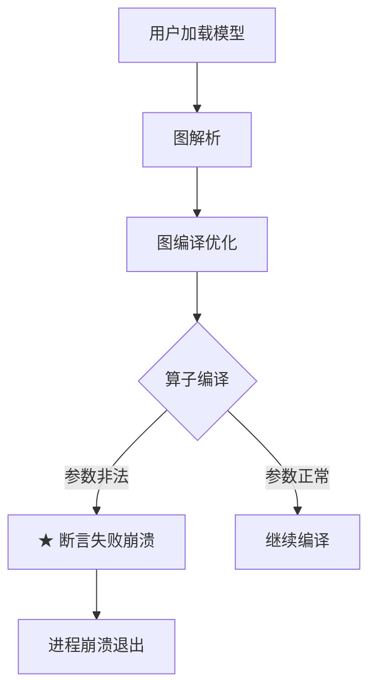

# coredump 诊断报告模板

## 报告结构

```markdown
# <崩溃进程/函数> 崩溃诊断

## 第一部分：结论速览

### 1.1 问题现象
- 崩溃类型：<SIGSEGV 空指针解引用 / SIGABRT 断言失败 / 越界访问 / 释放后使用 / ...>
- 崩溃信号来源：<coredump backtrace / 日志中的崩溃信号>
- 关键日志原文摘要：<日志文件:行号 + 关键文本；崩溃前日志不保证完整，仅列能搜到的标志性日志>

### 1.2 一句话根因
<根因或候选原因摘要：崩溃函数 + 崩溃原因 + 根因在哪一层；无法确认时写“候选原因”并标注未验证>

### 1.3 定界
- 责任边界：GE / external / env_or_version / undetermined（仅用于根因定界，不决定是否纳入 coredump 诊断；纳入标准见 SKILL.md 第 1 节）
- 问题发生模块（GE 问题时从以下 5 选 1）：
  - `入图/图解析`：前端图输入、模型解析、ONNX/PB/Caffe/MindSpore 解析、算子映射等
  - `图编译`：图优化、shape/format 推导、pass、引擎分区、tiling、内存/stream 分配、算子编译等
  - `图加载`：模型加载、om 解析、runtime model 初始化、任务下发前准备等
  - `图执行`：session run、executor 调度、kernel/task 执行、动态 shape 执行期处理等
  - `公共基础能力`：日志、dump、profiler、插件/so 加载、公共图数据结构、注册机制、环境/路径等跨阶段能力
- 仓库别名用于源码引用，业务阶段用于报告定界；两者是独立维度，不要互相替代。
- 判定依据：<一句话说明为什么定这个边界>

## 第二部分：详细分析

### 2.1 材料清单与定位级别
- 材料盘点表：<按 SKILL.md Step 1 的盘点结果列出：材料项/状态/依据/缺失影响>
- 当前定位级别：<按 SKILL.md Step 3 分级表写明本报告基于哪一档材料>
- 置信度说明：<本档对应的置信度，以及是否因版本不一致/缺帧/现场缺失下调>

### 2.2 详细根因
文字展开根因或候选原因，按当前定位级别覆盖；无法确认的字段写 `unknown/未验证`，并在 2.7“缺失信息”中说明原因。不得用推测填充字段。内容包括：

- 崩溃类型：空指针解引用 / 越界访问 / 断言失败 / 释放后使用 / 除零 / 踩内存
- 崩溃行：`[别名/path/file.cc:line]`
- 崩溃原因：为什么这行会崩溃（如指针 X 为 nullptr 因为上游 Y 没做 NULL 检查）
- 反向追溯（调用链视角）：
  1. 崩溃函数由谁直接调用，调用点在哪里
  2. 上游调用者及崩溃函数是否做了必要校验
  3. 根因层级：崩溃函数自身 / 调用者 / 不确定
- 设计意图：为什么这样处理；源码和材料无法确认时写 `unknown`，不猜测业务意图
- 反面论证：如果不这样会怎样；仅在能从源码逻辑推导时填写

**堆栈完整性判断**（必填）：
- 堆栈是否完整：backtrace 是否连续、有无被 `-O2/-O3` 优化掉的帧
- 栈帧是否损坏：是否存在栈溢出、栈被踩坏导致栈帧不可信
- backtrace 可信度：完整可信 / 部分缺失但主干可信 / 严重缺失需反向推断
- 不可信时的处理：从崩溃函数反向推断可能的调用者，标注不确定性，写入 2.7 缺失信息

**多线程分析**（必填）：
- 崩溃线程：线程 ID 及其职责（编译线程 / 执行线程 / GC 线程 / 其他）
- 其他线程状态：backtrace 中其他线程在做什么，是否与崩溃线程有共享数据访问
- 竞态条件判断：是否存在 race condition（共享数据无锁保护 / 锁顺序不一致 / 读写并发）
- 锁状态：崩溃时是否有线程持有/等待锁，是否死锁
- 结论表述分两档：仅凭单次 core 只能写"现场未发现竞态证据"；"已排除竞态"必须依赖 TSAN、稳定复现、锁协议证据或对照实验，不得只凭单线程栈得出

仅当参数跨模块或在调用链中发生关键变换、且该变化与崩溃有关时写**值传导链**。纯 GE 内部且没有关键值变换时，把参数来源写入上面的反向追溯即可，避免重复：

```markdown
**值传导链**：
1. 起点：原始值是什么，从哪来（GE 内部构造 / 外部传入）
2. GE 处理链路：值是否正确传导
3. 跨模块边界：传给外部或从外部传回时值的状态
4. 外部侧变化（有证据才写）：用户提供了外部源码、日志或文档时，指出外部哪个环节修改了值；没有证据时写 unknown，不猜测外部内部行为
5. 回传：修改后如何传回
6. 目标函数：用修改后的值做了什么
```

### 2.3 全景图
根据崩溃类型选择图类型：

**内存相关崩溃**（空指针解引用 / 越界访问 / 释放后使用 / 踩内存）→ 画**内存布局图**（ASCII），展示地址、对象、边界、越界点/踩内存区域：

```
地址              内存内容
0x7fff0000  ┌─────────────────────┐
            │ buffer.header       │
0x7fff0010  ├─────────────────────┤
            │ buffer.data[0]      │
0x7fff0020  │ buffer.data[1]      │ ← 越界访问点
0x7fff0030  ├─────────────────────┤
            │ next_object.header  │ ← 被踩内存
0x7fff0040  └─────────────────────┘
```

内存布局图规则：
- 标注关键地址（可从 backtrace / core 文件获取，无法获取时用相对偏移）
- 标注对象/结构体边界（`├───` 分隔不同字段或对象）
- 用 `←` 标注崩溃访问点、越界点、踩内存区域
- 用 `★` 标注关键内存状态（如"已释放""未初始化""非法地址 0x0"）
- 崩溃涉及堆栈布局（栈溢出、栈帧损坏）时画栈帧布局

**逻辑相关崩溃**（断言失败 / 除零 / 其他非内存问题）→ 画 **Mermaid flowchart 业务流程图**，让读者一眼看到"从哪个业务动作进入、经过哪些阶段、在哪崩溃"：



Mermaid 规则：
- 节点用**业务动作/状态**，不是函数名（如"图编译优化"不是 `GraphManager::Optimize`）
- 用 `★` 标注崩溃发生点，用 `{}` 菱形标注关键判断分支
- 用 `-->|条件|` 标注分支走向
- 禁止出现 `ClassName::FuncName`、源码行号——那些属于 2.4 函数调用栈
- 跨阶段崩溃时用 `subgraph` 画出阶段边界

### 2.4 函数调用栈
分两部分，不要混写：

1. **原始 backtrace**：原样保留用户提供的崩溃线程堆栈（及其他关键线程），来源可以是 `gdb_core.txt`、日志或用户文本，不做删改；不完整时明确标注。
2. **源码调用链**：按 `references/source_reference.md` 格式绘制，标明崩溃函数（`← 崩溃函数`）、非法参数来源（`← 非法参数来源`）；backtrace 不完整时明确标注反向推断的不确定性。

### 2.5 关键证据链
固定按以下链条写，缺失环节必须写入 2.7 缺失信息：

```text
崩溃信号 → 崩溃函数 → 崩溃行 → 崩溃原因 → 堆栈可信度 → 线程上下文 → 参数来源 → 防御检查 → 责任边界
```

1. 崩溃信号：SIGSEGV / SIGABRT / 其他，来源是 coredump backtrace 还是日志
2. 崩溃函数：栈顶函数名和别名限定的源码路径
3. 崩溃行：具体崩溃的代码行
4. 崩溃原因：什么操作导致了崩溃（空指针解引用 / 越界访问 / 断言失败 / ...）
5. 堆栈可信度：backtrace 是否完整可信 / 部分缺失 / 严重缺失需反向推断
6. 线程上下文：崩溃线程 ID 及职责、其他线程状态、是否涉及竞态
7. 参数来源：导致崩溃的非法参数是谁构造的、怎么传过来的
8. 防御检查：崩溃函数自身是否缺少防御性检查，或上游调用者是否缺少校验
9. 责任边界：GE / external / env_or_version / undetermined，并给出依据

### 2.6 排除项
至少写 1 条；如果没有足够证据排除，明确写"未排除"并说明原因。

- <排除项1：为什么不是其他模块的崩溃 / 环境版本问题 / 外部输入问题 / 其他线程竞态>
- <排除项2：可选>
- <排除项3：可选>

优先覆盖：
- 其他模块：说明其在 backtrace 中的位置和已有证据；若责任边界为 external，按证据填写，不因满足 GE 纳入标准而强行归因 GE，也不展开外部源码
- 环境/版本问题：说明是否有版本、路径、依赖、插件加载等证据
- 外部输入问题：说明是否已看到输入值、算子属性或模型结构证据
- 堆栈不完整：如果调用栈被优化掉，说明反向推断的不确定性
- 多线程竞态：如果涉及多线程，说明是否已排除其他线程干扰；仅凭单次 core 只能写"现场未发现竞态证据"，"已排除竞态"需 TSAN/稳定复现/对照实验支撑

### 2.7 缺失信息
逐条列出缺失材料和未验证判断；证据充分时标注"证据充分，无缺失项"。

## 第三部分：参考资料

### 3.1 崩溃环境
- CANN 版本：<从用户材料或日志中提取；无法确认填 unknown>
- 芯片型号：<用户指定 / 日志中提取 / unknown>
- 判断依据：<说明来源；无法确认写明>

### 3.2 源码版本
- 源码别名与根路径：<每个别名对应的仓根路径，如 ge → /path/to/ge>
- 源码版本/commit：<版本号或 commit；unknown 时说明>
- 版本核对情况：<默认未做专门核对，写“按用户提供版本直接分析”；分析中发现对不上并核实过的，写明核实结论和降级说明>
- 判断依据：<用户指定 / 由 CANN 版本推断 / 无法确认>

### 3.3 GE日志级别
- 级别：<DEBUG|INFO|WARNING|ERROR|混合|unknown|未提供>
- 判断依据：<根据日志实际命中的最详细有效级别填写（数值最小，如 DEBUG=0）；未提供日志时填"未提供"；崩溃前日志不保证完整>

### 3.4 崩溃现场
- 崩溃信号：<SIGSEGV / SIGABRT / 其他>
- signal 详细信息（按需，有则填）：
  - `si_addr`：<崩溃访问的具体地址；0x0 为空指针，非 0 可能是越界/踩内存>
  - `si_code`：<SEGV_MAPERR 地址未映射 / SEGV_ACCERR 地址映射但权限不对 / 其他>
- 崩溃线程：<线程ID 及职责，如"编译线程 TID=12345">
- 栈顶函数：<崩溃函数名 [别名/path/file.cc:line]>
- 崩溃行：<具体行号和代码摘要>
- backtrace 来源：<coredump backtrace / 日志中的崩溃信号 / ...>
- 可复现性（按需）：<必现 / 偶现 / 仅一次；偶现时附复现条件（特定模型、输入、配置、并发量）>
- ASAN/MSAN 信息（按需）：<是否有 AddressSanitizer/MemorySanitizer 报告；有则附关键信息>
- 崩溃时状态上下文（按需）：<崩溃发生在哪个阶段（编译期/加载期/执行期）、GraphId/SessionId、输入数据特征、进程内存使用情况>

### 3.5 模块入口函数
不需要就说"不需要"；需要就给出具体的接口：

- 用户/API入口：<如 ATC main_impl / aclgrphBuildModel / Session::BuildGraph / unknown；附别名位置>
- GE汇聚入口：<如 GraphManager::BuildGraph / RunGraph / unknown；附别名位置>
- 内部阶段入口：<如 DoBuildModel / PreRun / ModelExecutor::RunGraph / unknown；附别名位置>
- 崩溃函数入口：<崩溃函数 [别名/path/file.cc:line]>
- 入口链路依据：<源码调用点 / 日志锚点；无法确认写 unknown 并进入 2.7 缺失信息>

### 3.6 关键源代码
- `[别名/path/file.cc:line]` — 用途：确认崩溃行、调用者、防御性检查或非法参数来源

### 3.7 关键日志
- `<日志文件名:行号>` — `🔍 grep -RIn "<日志子串>" <日志目录>` — 用途：辅助确认崩溃前状态；未提供日志时写"本次未提供日志，日志依据未使用"

### 3.8 其他参考资料
- <文件名 / 网址 / 用户提供的其他材料> — 用途：<说明>
```
