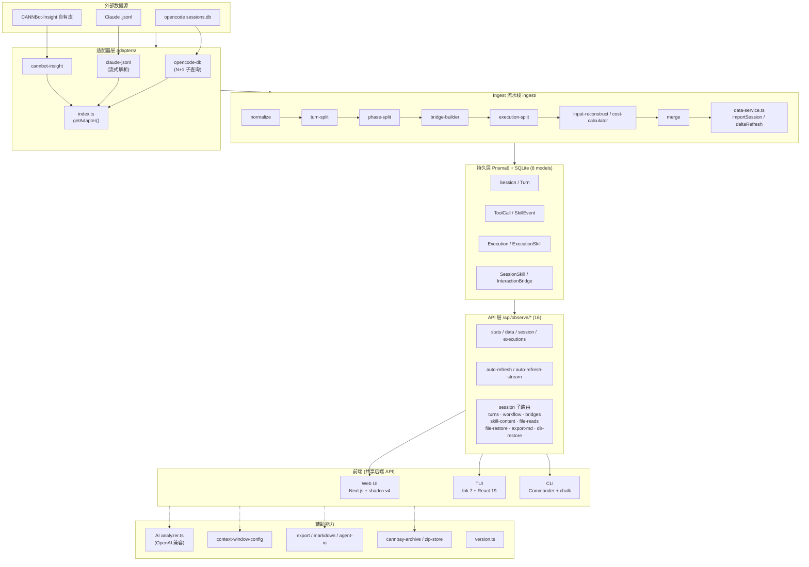
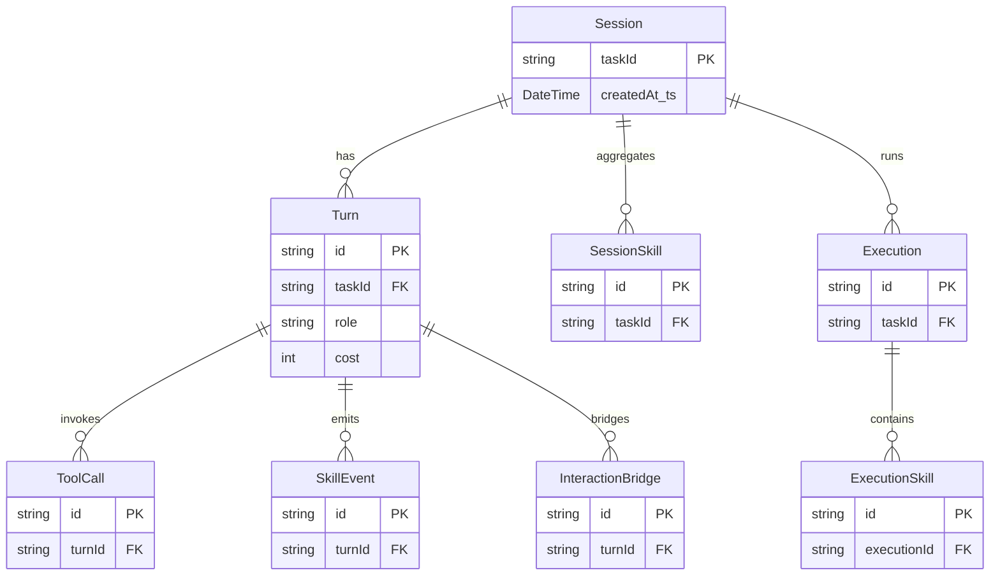

# CANNBot-Insight 架构图

> Session 级 LLM 编码 Agent(opencode)可观测性工具。Next.js 16 App Router + Prisma 6 + SQLite。

## 一、系统全景架构

```
┌─────────────────────────────────────────────────────────────────────────────┐
│                          外部数据源 (External Sources)                        │
│   opencode sessions.db   │   Claude .jsonl   │   CANNBot-Insight 自有库       │
└───────────┬──────────────────────┬──────────────────────┬──────────────────┘
            │ better-sqlite3 读      │ 文件读取             │
            ▼                       ▼                      ▼
┌─────────────────────────────────────────────────────────────────────────────┐
│                          适配器层 (Adapters)                                 │
│       src/lib/ingest/adapters/  —  适配器注册表 index.ts                      │
│   ┌─────────────────┐  ┌──────────────────┐  ┌────────────────────────┐     │
│   │  opencode-db    │  │   claude-jsonl   │  │   cannbot-insight      │     │
│   │ (N+1 子查询)    │  │  (流式解析)       │  │   (自有库读回)          │     │
│   └────────┬────────┘  └────────┬─────────┘  └───────────┬────────────┘     │
│            └──────────┬─────────┴────────────────────────┘                   │
│                       │ getAdapter(sourceType) → 统一 RawInteraction[]        │
└───────────────────────┼─────────────────────────────────────────────────────┘
                        ▼
┌─────────────────────────────────────────────────────────────────────────────┐
│                     数据处理流水线 (Ingest Pipeline)                          │
│                       src/lib/ingest/                                        │
│   RawInteraction                                                            │
│      │                                                                      │
│      ├─► normalize.ts        归一化(时间戳/角色/类型)                          │
│      ├─► turn-split.ts       按 Turn 切分                                     │
│      ├─► phase-split.ts      阶段切分                                         │
│      ├─► bridge-builder.ts   交互桥构建(InteractionBridge)                     │
│      ├─► execution-split.ts  执行单元切分                                     │
│      ├─► input-reconstruct.ts 输入重建                                        │
│      ├─► cost-calculator.ts  成本计算                                         │
│      └─► merge.ts           合并                                             │
│             │                                                                │
│             ▼  SkillEvent / 聚合                                            │
│      data-service.ts  (orchestrator)                                         │
│         ├─ importSession()        全量导入                                    │
│         ├─ deltaRefreshSession()  增量刷新                                    │
│         ├─ computeSessionAggregates()                                        │
│         └─ computeExecutionSkills()                                         │
└───────────────────────┬─────────────────────────────────────────────────────┘
                        ▼  createMany + $transaction
┌─────────────────────────────────────────────────────────────────────────────┐
│                     持久层 (Prisma 6 + SQLite)   8 models                   │
│  ┌──────────┐ ┌──────┐ ┌──────────┐ ┌───────────┐ ┌─────────────────────┐ │
│  │ Session  │ │ Turn │ │ ToolCall  │ │ SkillEvent│ │ Execution / ExecSkill│ │
│  └──────────┘ └──────┘ └──────────┘ └───────────┘ │ SessionSkill         │ │
│                                ┌──────────────────┐│ InteractionBridge    │ │
│                                │  src/lib/db.ts   │└──────────────────────┘ │
└───────────────────────────────┬┴──────────────────┘┴──────────────────────┘
                                ▼
┌─────────────────────────────────────────────────────────────────────────────┐
│                  API 层  16 个 /api/observe/* 端点                          │
│      stats │ data │ session │ executions │ auto-refresh(-stream)             │
│      session/{turns,turns/search,turns/[id],workflow,bridges,               │
│                skill-content,file-reads,file-restore,export-md,dir-restore}  │
└──────┬───────────────────┬──────────────────────┬──────────────────────────┘
       ▼                     ▼                      ▼
┌─────────────────┐  ┌─────────────────┐  ┌──────────────────────────────────┐
│   Web UI        │  │      TUI        │  │            CLI                   │
│ Next.js server  │  │  Ink 7 + React19 │  │  Commander + chalk              │
│ + shadcn v4     │  │  src/cli/tui/    │  │  src/cli/index.ts               │
│ + Tailwind v4   │  │  App.tsx         │  │  client.ts (InsightClient)     │
│ + @base-ui      │  │                  │  │  → 15 端点封装                   │
│                 │  │                  │  │                                  │
│ page.tsx        │  │  (纯 API 客户端) │  │  types.ts (Api- 前缀)           │
│ session/[taskId]│  │                  │  │                                  │
│  settings       │  │                  │  │                                  │
│  workflow-flow  │  │                  │  │                                  │
│  compare        │  │                  │  │                                  │
│  monitor        │  │                  │  │                                  │
└─────────────────┘  └─────────────────┘  └──────────────────────────────────┘
       │                     │                      │
       └─────────────────────┴──────────────────────┘
                             │
                             ▼  前端共享类型 src/lib/shared/types.ts
┌─────────────────────────────────────────────────────────────────────────────┐
│                    辅助能力 (Cross-cutting Capabilities)                     │
│  AI 分析: analyzer.ts (OpenAI 兼容) │ trajectory-analyzer.ts                 │
│  上下文: context-window-config.ts   │ Web ContextTracker.tsx (需手动同步)    │
│  导出:   export-service.ts │ markdown-exporter.ts │ agent-io-export.ts       │
│  归档:   cannbay-archive.ts │ zip-store.ts │ file-restore / file-reads.ts    │
│  版本:   version.ts (展示版本，非 package.json)                              │
└─────────────────────────────────────────────────────────────────────────────┘
```

## 二、数据流（Ingest 主链路）

```
opencode sessions.db  ──better-sqlite3──►  opencode-db 适配器
    (N+1: per-session / per-message 子查询到 part 表)
                                                  │
                                                  ▼  RawInteraction[]
   normalize ─► turn-split ─► phase-split ─► bridge-builder ─► execution-split
                                                  │
                          ┌───────────────────────┤
                          ▼                       ▼
                   SkillEvent 聚合          cost / input 重建
                          │
                          ▼
              data-service.ts  importSession()
                          │  createMany + $transaction
                          ▼
              Prisma 8 models (SQLite)  ──►  /api/observe/*  ──►  Web/TUI/CLI
```

## 三、三种前端模式对比

| 模式 | 入口 | 渲染 | 共享 |
|------|------|------|------|
| **Web UI** | `src/app/page.tsx` (server, 直连 Prisma) | Next.js + shadcn v4 + Tailwind v4 + @base-ui/react | 同一 15+ 端点 API |
| **TUI** | `src/cli/tui/App.tsx` | Ink 7 + React 19 (ESM strict) | 纯 API 客户端 |
| **CLI** | `src/cli/index.ts` (Commander) | chalk + string-width + cli-truncate | `client.ts` 封装 15 端点 |

> Session 详情页 `session/[taskId]/` 为 `"use client"`，含 9 个 Tab，均从 `/api/observe/*` 拉取。

## 四、Mermaid 架构图



## 五、Prisma 8 模型关系



## 六、关键约束与注意事项

- **ESM strict**：`package.json` 含 `"type": "module"`，禁用 `require()`。
- **零 Prisma schema 变更**：特性开发不改 schema，计算数据在 API/渲染时构建。
- **Turn 无 cost 字段**：API 映射中设 `cost: 0`，写入前从 `TurnRow` 剥离。
- **`createdAt_ts` 可空**：fallback `createdAt` + `.toISOString()`。
- **ContextTracker 同步**：`context-window-config.ts` 与 Web `ContextTracker.tsx` 的模型映射需手动保持一致。
- **AI 分析**：仅 OpenAI 兼容 `/chat/completions`，必须 `response_format: json_object`；输入仅 root assistant/user/system turns，30K 字符预算。
- **Ink v7**：无 `lastFrame/frames/output`；禁用第三方组件(ink-table/ink-select/ink-spinner)，全部自实现。
- **CJK 宽度**：中文字符 = 2 列，CLI 一律用 `string-width`。
- **路径别名**：统一 `@/lib/...` / `@/components/...`，禁相对路径回溯。
- **GitCode 托管**：禁用 `gh` CLI。
```
