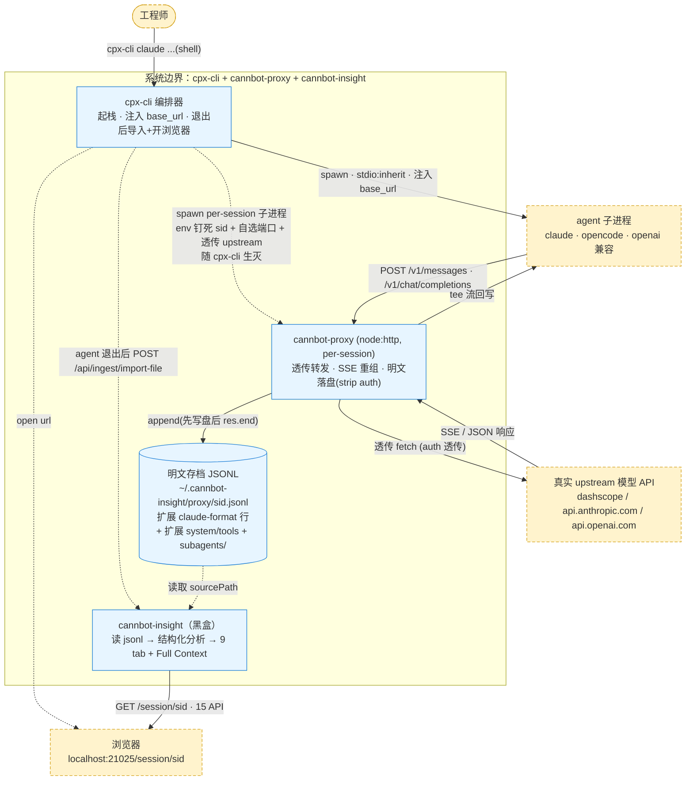
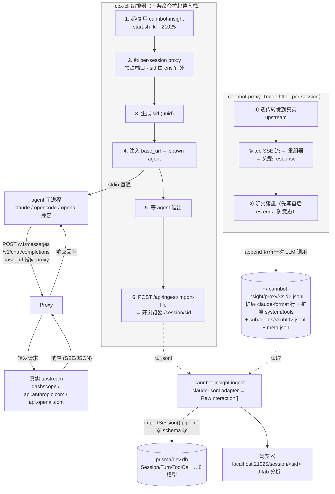

# cannbot-proxy — Agent↔模型明文捕获代理

## 1. 是什么

一个类 claude-code-router 的**透传捕获代理**：拦截 agent（Claude Code / opencode / 任意 OpenAI 兼容客户端）与模型 API 的交互，**明文落盘**，再用 cannbot-insight 做 session 维度分析。

核心诉求：**易用**（一条命令拉起整套栈）、**明文留存**、**复用 cannbot-insight 现有分析面**（不重写分析侧）。

## 2. 上下文图（内外部组件关系与职责）

系统边界 = cpx-cli + cannbot-proxy + cannbot-insight。边界外（虚线黄）：人、agent 进程、真实模型 API、浏览器。边界内（蓝）：编排、透传捕获、明文存档、结构化分析。



**职责一览**

| 组件 | 内/外 | 职责 |
|---|---|---|
| 工程师 | 外 | `cpx-cli <agent>` 一条命令拉起整套栈 |
| agent 子进程 | 外 | 发起 LLM 请求；stdio 直通用户；base_url 被 cpx-cli 指向 proxy |
| 真实 upstream 模型 API | 外 | 推理；SSE/JSON 响应（dashscope / anthropic / openai） |
| 浏览器 | 外 | 查看 `/session/<sid>` 9 tab 分析面 |
| cpx-cli 编排器 | 内 | 起 cannbot-insight + per-session spawn cannbot-proxy（env 钉死 sid）、注入 base_url、spawn agent、agent 退出后触发导入 + 开浏览器 |
| cannbot-proxy (node:http) | 内 | 透传转发到 upstream、SSE 重组、明文落盘（落盘前 strip auth、先写盘后响应）；非常驻，随 cpx-cli 生灭 |
| 明文存档 JSONL | 内 | 扩展 claude-format（user/assistant 行 + 扩展 `system`/`tools` 字段；subagent 在 `subagents/<subId>.jsonl` + `.meta.json`）；一身二任（cannbot-insight 输入 + 明文存档） |
| cannbot-insight（黑盒） | 内 | 读 JSONL → 结构化分析（8 Prisma 模型，零 schema 改；`Session.sourcePath` 反指 jsonl）→ 15 API + Web/TUI/CLI + 9 tab + Full Context（System/Tools/Memory/Skills/Messages） |

**关键契约**：agent↔proxy↔upstream 走 HTTP（auth 透传、落盘前 strip）；proxy→JSONL 走本地 `append`（先写盘后 `res.end`，防秒退竞态）；cpx-cli 退出后 JSONL 由 cannbot-insight 读入（`Session.sourcePath` 反指该文件）。明文（扩展 claude-format）不进 Prisma——JSONL 一身二任（cannbot-insight 输入 + 明文存档），符合 "Zero schema changes" 约束。

## 3. 架构



**三层职责**：cpx-cli 编排（拉起+导入）／cannbot-proxy 透传捕获（明文落盘）／cannbot-insight 分析（现有，零改动）。agent↔proxy↔upstream 走 HTTP，proxy↔jsonl 走本地文件，cpx-cli 退出后 jsonl 由 cannbot-insight adapter 读入。

## 4. 使用方式

```bash
# 一次性安装：把 cpx 软链到 PATH（/usr/local/bin 或 ~/.local/bin），之后任意目录裸用
./proxy/start.sh        # 或 cd proxy && ./start.sh

# 任意目录、任意终端：
cpx claude -p "用一句话介绍自己"   # 冒烟：非交互，最快验证全链路
cpx claude                        # 正式交互式（/exit 退出后自动导入）
cpx opencode                      # opencode（注：未实测，见边界）
cpx -- aichat "..."                # 任意 OpenAI 兼容客户端

# 状态与配置：
cpx status                        # insight/proxy 进程状态 + 最近捕获 + 压缩率
cpx config                        # 查看配置
cpx config dedup on               # 开启注入压缩（默认 off）
cpx config dedup off              # 关闭
```

**注入压缩（dedup，默认关闭）**：claude-code 会在每轮用户输入前重新追加一份**内容完全相同**的 agent 注册表 + skills 清单（实测 ~7KB/份）。开启后，捕获 jsonl 里首份全文记录，后续逐字节相同的重注入替换为一行 `[已压缩]` 标记（携带 `deduped:true` + `originalChars`）：

- 只压缩**捕获记录**，不改动转发给上游的请求——模型永远看到完整注册表，零功能风险
- 内容有变化的清单照常全文记录（刷新语义不受损）；普通消息 / tool_result 永不压缩
- 主 agent 与各 subagent 的上下文**各自独立判重**（同一段注册表在两个上下文里各留一份全文）
- `cpx status` 显示每个捕获文件的 `dedup ×N 压缩率`；配置存于 `~/.cannbot-insight/cpx-config.json`，**热生效**（每次 emit 时读取，`cpx config dedup on/off` 立即作用于进行中的会话，无需重启）

> `proxy/start.sh` 把 `cpx` 软链到 PATH 指向 `proxy/cpx-cli` wrapper；wrapper cwd 无关、自解析位置、往上找已装 `tsx`（根 node_modules）+ `proxy/src/cli/cpx-cli.ts`。重跑安全。不想全局装也可直接 `./proxy/cpx-cli claude ...`。命令名 `cpx`，编排器模块文件仍是 `cpx-cli.ts`/wrapper `cpx-cli`。


**启动时打印**：session id、profile、真实 upstream、proxy 端口、**捕获文件路径 + `tail -f` 命令**。

**数据落点**：
- 明文存档：`~/.cannbot-insight/proxy/<sid>.jsonl`（**扩展 claude-format**：每行 user/assistant + 扩展 `system`/`tools` 字段；subagent 在 `<sid>/subagents/<subId>.jsonl` + `.meta.json`）
- 结构化分析：cannbot-insight 的 `prisma/dev.db`（Session/Turn/ToolCall…），cpx 用 `source:'claude-jsonl'` 导入复用现成 claude-jsonl adapter，`Session.sourcePath` 指回主 jsonl
- 浏览器：`http://localhost:21025/session/<sid>`

**不影响平时用 agent**：override 只活在 cpx-cli 起的那个进程里，退出即净，不碰 `~/.claude/` 配置。

## 5. 实现情况

### ✅ 已完成并验证

| 模块 | 文件 | 状态 |
|---|---|---|
| 代理 server（双协议路由 + 透传 + tee 流） | `proxy/src/server.ts` | ✅ 流式/非流式 smoke 通过 |
| SSE 重组器（Anthropic content_block / OpenAI delta） | `proxy/src/stream-reassembler.ts` | ✅ 单测 |
| session 归因（路径 sid / header / 指纹 / per-session env 钉死） | `proxy/src/session-resolver.ts` | ✅ |
| 明文落盘（扩展 claude-format：每行 user/assistant + 扩展 system/tools 字段 + `subagents/` + meta.json，先写盘后响应） | `proxy/src/writer.ts` + `proxy/src/claude-emitter.ts` | ✅ 竞态已修 |
| claude-emitter（wire-record → 扩展 claude 行；delta emit 新 user 消息含 tool_result；subagent 按 `cc_is_subagent` + task-prompt 哈希路由到 `subagents/<subId>.jsonl` + meta.json 带 toolUseId） | `proxy/src/claude-emitter.ts` | ✅ IT |
| cpx-cli 编排 CLI（起 insight+proxy+agent，自动导入+开浏览器；导入源 `claude-jsonl`） | `proxy/src/cli/cpx-cli.ts` | ✅ |
| `cpx` 全局命令（一次性 `proxy/start.sh` 软链到 PATH，任意目录裸用） | `proxy/cpx-cli` wrapper + `proxy/start.sh` + `package.json` bin | ✅ smoke |
| subagent 切分（proxy emitter 路由 subagents/ + meta.json，**复用 cannbot-insight claude-jsonl adapter 原生 subagent 流程**，core pipeline 不改） | `proxy/src/claude-emitter.ts` + `src/lib/ingest/adapters/claude-jsonl.ts` | ✅ IT |
| Full Context（System/Tools 从扩展字段、Memory/Skills 扫 message；claude-jsonl readFullContext + turns route 放宽到 claude-code framework） | `src/lib/ingest/adapters/claude-jsonl.ts` + `turns/[turnId]/route.ts` | ✅ IT |
| 真实 system prompt 落成 system turn（不再 hidden 残差） | adapter | ✅ |
| tool_result 回填到对应 tool_use | adapter | ✅ |
| 测试（proxy 自包含 12 用例：JSON 内容校验，无 Prisma/insight 依赖；全量 `npm run test` 通过） | `proxy/tests/claude-emitter.test.ts` + `proxy/tests/reassembler.test.ts` | ✅ |
| 注入压缩（dedup，默认 off，`cpx config dedup on\|off`；只压记录不改转发；主/子代理上下文独立判重；status 显示压缩率） | `proxy/src/claude-emitter.ts` + `proxy/src/cli/cpx-cli.ts` | ✅ IT（真实任务验证子代理派发不受影响） |

**端到端实测**：`cpx-cli claude -p` → claude `--settings` 进程级注入生效 → 请求被 proxy 拦截 → sid 精确归因 → glm-5.2 真实响应捕获 → auth 未泄漏 → 导入 insight → system turn 落库（"You are Claude Code..."）。

### ⚠️ 当前版本边界（已知，不阻塞）

1. **opencode 注入未实测**：当前用 shell env `OPENAI_BASE_URL`，若 opencode build 也像 claude 那样 config 文件优先于 shell env，会拦不住——需类似 claude 的进程级注入（查 opencode `--config` / config 覆盖能力）。
2. **system prompt 中途增长仅落盘未呈现**：emitter 已在**每条** assistant 行 verbatim 携带扩展 `system` 字段（数据全留），但 claude-jsonl 的 `readFullContext` 目前只取第一条带 `tools` 的 assistant 行的 system——session 中途 system 变化（/compact、skill 注入追加）仍只呈现首次。需 `readFullContext` 按内容 hash 去重逐段呈现。
3. **per-message token 是估算**：总量（如 55.2k）是模型自报真实值；但 per-message 拆分（system ≈694t）是 insight 的 char/3.5 估算。要 verbatim 每条消息 token 需读路径从 jsonl 取真实 request body（read-path 增强）。
4. **同任务多次 spawn 会合并**：subagent 按 task-prompt 哈希分组，若同一 session 内主 agent 用相同 prompt 二次 spawn 子代理，两条会并到同一 subagent_session_id。极少见；要区分需加时序序号。
5. **model 路由/key 池**（CCR 核心能力）：当前版本只透传捕获，不做 model 映射/多 key 路由。留到后续版本。

### 🔲 待完善（用户后续补充）

> 此处由用户基于实际使用补充后续要做的内容。

## 6. 关键设计决策

| 决策 | 原因 |
|---|---|
| per-session 独占端口（非共享 daemon） | sid 由 env 钉死，不靠 URL 路径/header/指纹，100% 可靠；且避开 Anthropic SDK 用绝对路径拼接会吃掉路径 sid 的问题 |
| claude 用 `--settings` 进程级注入（非 shell env） | Claude Code 的 `~/.claude/settings.json` env 块优先级高于 shell env，shell env 拦不住；`--settings` 只对该进程生效，退出即净，不残留全局状态 |
| 不改 `~/.claude/` 任何文件 | cpx-cli 崩了/被 kill 也不会让下次裸 `claude` 连不上（零残留） |
| 真实 upstream 从用户 settings 读 | 用户 base_url 可能是 dashscope 等非官方 endpoint，proxy 必须转发到对的地方 |
| 明文存扩展 claude-format，不进 Prisma | `Turn.inputMessagesJson` 在 ingest 时永远 null（读取时重构），proxy 把请求 verbatim 转成扩展 claude-format 行（user/assistant + 扩展 `system`/`tools`）写 jsonl，`Session.sourcePath` 指回——一身二任：既是 adapter 输入又是明文存档。符合 "Zero schema changes" 约束 |
| 先 `appendRecord()` 再 `res.end()` | 防 claude 秒退 + cpx-cli 杀 proxy 的竞态导致记录丢失（曾导致 import 0 条） |
| system prompt emit 成 system turn | 让 insight 的 LLM Input 重构纳入真实 system，把 "System (hidden) ≈734t" 残差变成真实内容 |
| proxy 测试自包含（vitest projects 独立 project，无 Prisma/insight 依赖） | proxy 与 insight 仅靠 **claude-format 契约**耦合：proxy 测试只验 emitter 产出的 JSON 内容，insight 的 claude-jsonl adapter（自有测试）消费；两边独立演进，proxy 不因 Prisma/`@` alias 变动而红 |
| 注入压缩只压捕获记录、默认关闭 | claude 无条件重注入注册表的设计假设上游有 prompt cache；改动转发有功能风险，改动记录没有。因此 v1 只做记录瘦身（标记 + originalChars 保信息），转发去重（含缓存感知旁路）留待后续按需求实施 |
