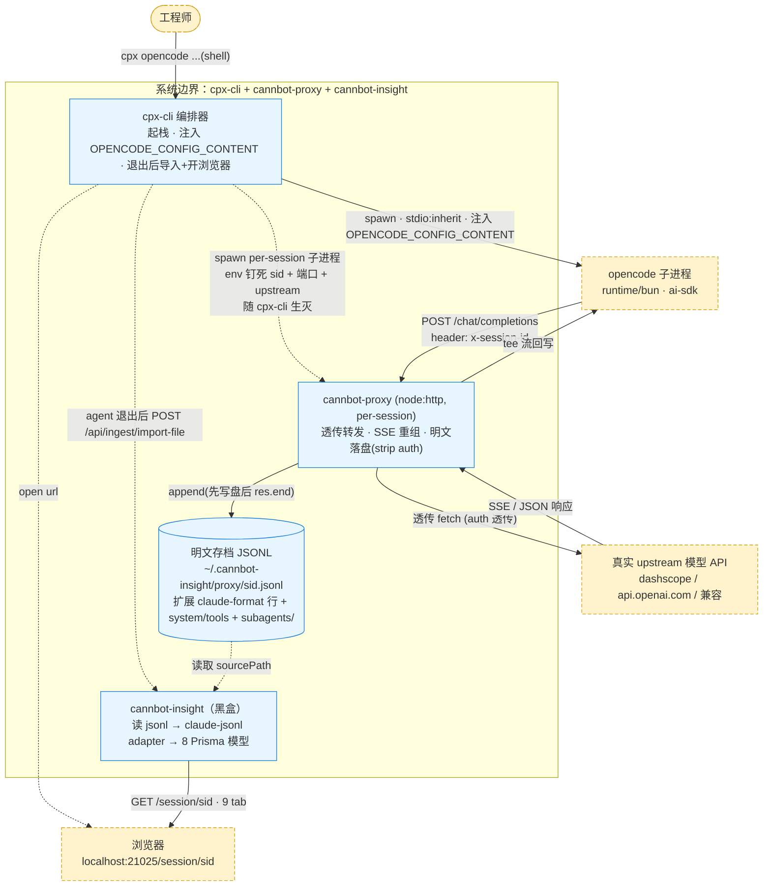
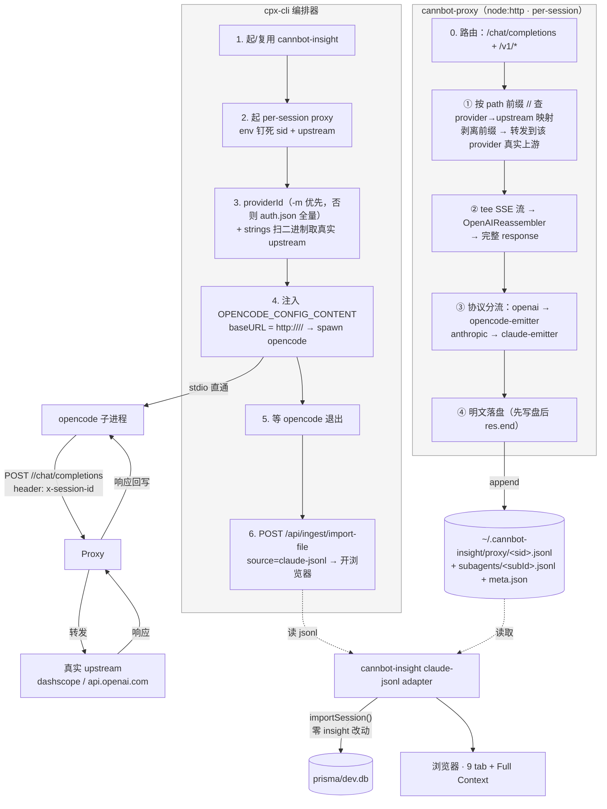

# opencode-proxy — opencode↔模型明文捕获代理

## 1. 是什么

opencode 版的透传捕获代理：拦截 opencode 进程与模型 API 的交互，明文落盘成扩展 claude-format JSONL，再用 cannbot-insight 现有 claude-jsonl adapter 做 session 维度分析。

与 claude proxy 对称：per-session 独占端口、env 钉死 sid、透传 tee 流、先写盘后 res.end、agent 退出后导入。**但 emitter 独立实现**（`opencode-emitter.ts`），不和 claude-emitter 共用转换逻辑——因为 OpenAI wire 格式（system 在 messages、tools 是 function 格式、subagent 靠 x-session-id）与 Anthropic 截然不同。

**捕获 ≠ 解析（capture ≠ interpret）**：proxy（`opencode-emitter`）是纯 verbatim 捕获层——assistant 行的 `system` 扩展字段写 opencode system **原文**（内置指令 + `Instructions from:` 记忆 + `<available_skills>` 技能，原貌不拆），`tools` 仅做 OpenAI function→`{name,description}` 的格式归一。opencode system 的结构化解析（拆 instructions/memory/skills）由**独立工具 `opencode-context-parser`** 拥有——它读 jsonl 的 `system` 字段，按 opencode 原生标记解析。jsonl 是单一数据源、可随时用新逻辑重解析（`systemRaw` 始终保留）。parser 独立于 cannbot-insight（不依赖 insight import/DB），将来再考虑并入 insight（在 readFullContext 加 opencode 分支调 `parseOpencodeContext`）。

## 2. 设计约束

| # | 约束 | 落实方式 |
|---|---|---|
| 1 | 不修改 cannbot-insight | 产出物走 insight 现有 `claude-jsonl` adapter（framework 标 `claude-code`）做 turns/messages，不碰 insight 任何文件；**system 上下文解析不在 insight**——由独立工具 `opencode-context-parser` 读 jsonl 的 `system` 字段解析（将来并入 insight 时在 readFullContext 加 opencode 分支，不改既有 claude 逻辑） |
| 2 | 原理和 claude code 一致 | per-session 独占端口 + env 钉死 sid + 透传 tee + 先写盘后 res.end + 退出后 import |
| 3 | 产出 json 非 db（减 sqlite 依赖） | 产出扩展 claude-format JSONL（纯文本），proxy 全程不碰 better-sqlite3/opencode.db/Prisma |
| 4 | 两套独立框架 | opencode emitter 独立文件 `opencode-emitter.ts`，不复用 claude-emitter 的 emit 逻辑；仅复用中立基础设施（writer.ts 文件写入、stream-reassembler.ts 的 OpenAIReassembler） |

**阶段定调**：产出物**先走 insight 的 claudecode 框架读取验证**（framework='claude-code'）。将来再做 opencode 专属 adapter 时，proxy 产出格式已留好扩展点，切换无需改 proxy 捕获层。

## 3. 上下文图



## 4. wire-level 实证（抓包结论）

跑 `opencode run -m alibaba-cn/glm-5.2 "..."`，用 OPENCODE_CONFIG_CONTENT 注入 baseURL 到抓包 server，捕获真实请求：

| 发现 | 实证 | 设计影响 |
|---|---|---|
| 请求路径 | `POST /chat/completions`（**无 /v1 前缀**） | proxy 路由判断加 `/chat/completions` 识别 |
| session 标识 | header `x-session-id: ses_xxx` + `x-session-affinity` | subagent 是 child session 带不同 id → **可靠 subagent 路由** |
| system 位置 | `messages[0]` 里 `role:"system"`，无 top-level `system` | emitter 从 messages 提取 system |
| tools 格式 | OpenAI function `{type:"function",function:{name,description,parameters}}` | emitter 转 `{name,description}` 挂扩展字段 |
| title 生成 | 同 session 独立请求，system 含 "You are a title generator" | 靠 system 文本识别并跳过 |
| user-agent | `opencode/1.17.11 ... runtime/bun` | 额外识别信号 |
| 注入生效 | OPENCODE_CONFIG_CONTENT 覆盖 baseURL 成功 | 拍板用此机制（对齐 claude `--settings`） |
| `OPENAI_BASE_URL` 被忽略 | `opencode debug config` 实测：设 `OPENAI_BASE_URL=http://127.0.0.1:39999` 后 alibaba-cn 的 baseURL **不变**；而 `OPENCODE_CONFIG_CONTENT` 改之即变 | **禁用** OPENAI_BASE_URL fallback——opencode 的 provider baseURL 是内置的，不读通用 env；交互式 `cpx opencode`（无 -m）必须走 auth.json 多 provider 注入 |
| provider 发现 | `~/.local/share/opencode/auth.json` 顶层 key 即 provider id（如 `alibaba-cn`、`zhipuai-coding-plan`），value 含 `type`+`key`，**无 baseURL**（baseURL 内置于 opencode 二进制） | 无 -m 时读 auth.json，对**每个**已登录 provider 都注入 baseURL 覆盖，无论 opencode 运行时选哪个都路由进 proxy |
| **路径前缀被保留** | 实测：baseURL 设 `http://h/<providerId>/`（尾斜杠）时，opencode/ai-sdk 发 `POST /<providerId>/chat/completions`——前缀不被 SDK URL normalization 剥离 | per-provider 路径前缀路由可行：baseURL 注入 `http://<proxy>/<providerId>/`，proxy 从 path 前缀识别 provider |
| **真实 upstream 可从二进制提取** | `strings -n 8 <opencode.exe> \| grep -oaE 'id:"…",env:\[…\],npm:"…",api:"…"'` 逐 provider 输出 `id`↔`api`（`alibaba-cn`→`https://dashscope.aliyuncs.com/compatible-mode/v1`，`zhipuai-coding-plan`→`https://open.bigmodel.cn/api/coding/paas/v4`），~1s/167MB | **从用户自己装的二进制读**（非编造）→ cpx 把 provider→upstream 映射传给 proxy，proxy 按前缀路由到正确上游，**用户无需配 CANNBOT_PROXY_OPENAI_UPSTREAM** |
| **opencode system 三段结构** | system 原文分三段：① 内置指令（开头到首个 `Instructions from:` 前，含 `<env>`）；② 记忆文件 `Instructions from: <path>\n<内容>`（可多块，如 AGENTS.md，等价 claude 的 CLAUDE.md）；③ 技能 `<available_skills><skill>…` | proxy 的 `opencode-emitter` 把 system 原文 verbatim 写进 `system` 扩展字段（不拆）；结构化解析（拆三段）由独立 `opencode-context-parser` 按原生标记做。capture≠interpret，jsonl 可重解析 |

## 5. 架构



三层职责：cpx-cli 编排（拉起+注入+导入）／cannbot-proxy 透传捕获（明文落盘，按协议分流 emitter）／cannbot-insight 分析（黑盒，零改动，走 claude-jsonl adapter）。

## 6. 关键设计决策

| 决策 | 原因 |
|---|---|
| emitter 独立（opencode-emitter.ts，不复用 claude-emitter.emit） | OpenAI wire 格式（system 在 messages、tools 是 function、subagent 靠 x-session-id）与 Anthropic 截然不同；独立实现避免在 claude-emitter 里塞协议分支，保持两套框架真隔离 |
| 产出扩展 claude-format，走 claude-jsonl adapter | 不改 insight 的硬约束下，claude-jsonl adapter 是现有能读 jsonl 的唯一 adapter；framework='claude-code' 使 readFullContext 生效，opencode 会话能看 verbatim System/Tools/Memory/Skills |
| 注入用 OPENCODE_CONFIG_CONTENT（非 shell env） | opencode config 优先级里 inline config 第 6（仅次于 managed），高于 project/global config——和 claude `--settings` 进程级语义对称；退出即净，不碰 ~/.config/opencode/ |
| **禁用** OPENAI_BASE_URL fallback，改读 auth.json 多 provider 注入 | 实测 opencode 的 provider baseURL **内置**于二进制、不读 `OPENAI_BASE_URL`（`opencode debug config` 验证）。交互式 `cpx opencode`（无 -m）走 fallback 必然 0 捕获（原"无 jsonl 文件"bug）。改法：无 -m 时读 `~/.local/share/opencode/auth.json` 取所有已登录 provider id，对**每个**都注入 `OPENCODE_CONFIG_CONTENT` baseURL 覆盖；无 provider 则**报错退出**（不再静默 fallback） |
| provider 解析：-m 优先，否则 auth.json 全量 | -m `<provider>/<model>` 精确覆盖单个 provider；无 -m 时 opencode 运行时才选默认 provider，cpx 无法预知，故覆盖全部已登录 provider。两条路径都保证 opencode 实际用的那个 provider 被重定向到 proxy |
| subagent 路由靠 x-session-id（非 system prompt 文本） | opencode 的 subagent 是 child session 带不同 x-session-id，wire-level 明确可识别——比 claude 靠 cc_is_subagent 文本更可靠；proxy 记首个 x-session-id 为主，其余路由到 subagents/ |
| per-session 独占端口（复用 claude proxy 模式） | sid 由 env 钉死，不靠 URL path/header 归因——和 claude proxy 一致，避开 SDK 路径拼接问题 |
| 先 appendRecord() 再 res.end() | 防 opencode 秒退 + cpx-cli 杀 proxy 的竞态导致记录丢失（和 claude proxy 一致） |
| per-provider 路径前缀路由 | baseURL 注入 `http://<proxy>/<providerId>/`（尾斜杠）。实测 opencode/ai-sdk **保留**前缀发 `POST /<providerId>/chat/completions`。proxy 从 path 前缀识别 provider、查映射得真实 upstream、剥离前缀后转发（`dashscope…/v1` + `/chat/completions`）。多 provider 不同上游也能同会话正确路由，**无需用户配 upstream** |
| 真实 upstream 从二进制自动发现（非编造） | `strings -n 8 <opencode.exe> \| grep -oaE 'id:"…",env:[…],npm:"…",api:"…"'` 逐 provider 取 `api:` URL（alibaba-cn→dashscope、zhipuai-coding-plan→bigmodel…），~1s。**从用户自己装的二进制读**，非硬编码推测；cpx 把映射经 `CANNBOT_PROXY_PROVIDER_UPSTREAMS` 传给 proxy。读不到的 provider 回退到单一 `CANNBOT_PROXY_OPENAI_UPSTREAM`（默认 api.openai.com，用户可覆盖） |
| usage 归一化责任在 reassembler，emitter 只直传 | OpenAIReassembler/reassembleOpenAIJson 已把 `prompt_tokens`/`completion_tokens` 归一为 Anthropic shape（`input_tokens`/`output_tokens`，reassembler.test.ts 覆盖）。emitter 的 mapUsage 只直传——之前 emitter 又按 OpenAI 格式重映射（读 `prompt_tokens`，已不存在）→ 全 0 → insight 无 System(hidden)/Other context。两 emitter 对称直传 |
| **capture ≠ interpret：proxy verbatim 捕获，独立 parser 解析** | opencode system 的 memory（`Instructions from:`）/skills（`<available_skills>`）在 `system` 扩展字段里。早期方案是 proxy 解析后合成 claude `<system-reminder>`（`# claudeMd` 标记）注入，迁就 insight 的 claude-hardcoded `readFullContext`——但带来：合成 reminder 被 adapter 拆成 DB 'system' turn（UI 冗余 + DB 取舍）、jsonl 夹 claude 标记非原貌、解析逻辑错配（proxy opencode-aware + insight claude reader）。改：proxy 只 verbatim 写 `system`（原文，含三段），解析逻辑搬到独立 `opencode-context-parser`（读 `system` 按原生标记拆 instructions/memory/skills）。Q1 的 DB 'system' turn 取舍随之消失（无合成 reminder）。jsonl 可重解析 |

### framework 语义妥协

opencode 会话导入后 `framework='claude-code'`（走 claude-jsonl adapter）。语义上不精确（实际是 opencode 会话），但是约束 1（不改 insight）下的必然选择——insight 没有 opencode-jsonl adapter，`opencode` framework 对应 opencode-db adapter（读 sqlite，不走 jsonl）。**阶段定调**：先借 claudecode 框架读取验证，将来做 opencode 专属 adapter 时，proxy 产出格式已与 claude 同构，切换框架只需改 adapter 不改 proxy 捕获层。

### subagent 路由

opencode 的 subagent 是 opencode 进程内部 spawn 的 child session（opencode.db 里 `session.parent_id` 指向父）。wire-level 上，child session 的请求带**不同的 `x-session-id`**。proxy 路由逻辑：
1. 记首个见到的 `x-session-id` 为 `mainXSessionId`
2. 后续请求 `x-session-id === mainXSessionId` → 写主文件 `<sid>.jsonl`
3. `x-session-id !== mainXSessionId` → 写 `<sid>/subagents/<x-session-id>.jsonl` + 一次性 `meta.json`（带 toolUseId，尽力从主 agent Task tool_call 提取）
4. 复用 insight 的 `listSubagentSessions`/`collectSubagentToolUseMappings`（按 claude 目录约定扫 `subagents/*.jsonl` + `meta.json`）

与 claude proxy 对比：claude 靠 system prompt 含 `cc_is_subagent=true` + task-prompt 哈希；opencode 靠 x-session-id，无需哈希，更直接。

## 7. 使用方式

```bash
# 一次性安装（和 claude 共用）
./proxy/start.sh

# opencode 冒烟（非交互，带 -m）
cpx opencode run -m alibaba-cn/glm-5.2 "用一句话介绍自己"

# 正式交互式（无需 -m，cpx 自动读 auth.json 覆盖全部已登录 provider）
cpx opencode

# claude 仍照旧（两套独立，互不影响）
cpx claude -p "..."
```

**provider 解析**：`-m <provider>/<model>` 给定时只覆盖该 provider；否则读 `~/.local/share/opencode/auth.json`，对每个已登录 provider 都注入 baseURL 覆盖（opencode 运行时选哪个都路由进 proxy）。两者皆无时报错退出（不静默 fallback）。

**upstream 自动发现（用户无感）**：cpx 启动时用 `strings` 扫 opencode 二进制，提取每个已登录 provider 的真实 `api:` URL（alibaba-cn→dashscope、zhipuai-coding-plan→bigmodel…），经 `CANNBOT_PROXY_PROVIDER_UPSTREAMS` 传给 proxy。proxy 按 `/<providerId>/` path 前缀把请求路由到对应真实上游——**无需用户设任何 env**。仅当某 provider 在二进制里提取不到时，才回退到 `CANNBOT_PROXY_OPENAI_UPSTREAM`（默认 `https://api.openai.com`，可 export 覆盖）；此时启动日志会标注该 provider「upstream not found in binary」。

**启动时打印**：session id、profile、真实 upstream、proxy 端口、捕获文件路径 + `tail -f` 命令、注入的 provider 列表 + 来源（-m / auth.json）+ 各 provider → 真实 upstream 映射。

**数据落点**：
- 明文存档：`~/.cannbot-insight/proxy/<sid>.jsonl`（+ `subagents/`）
- 结构化分析：cannbot-insight 的 `prisma/dev.db`，source='claude-jsonl'，`Session.sourcePath` 指回 jsonl
- 浏览器：`http://localhost:21025/session/<sid>`

## 8. 改动清单（全在 proxy/ 内）

| 文件 | 改动 | 类型 |
|---|---|---|
| `proxy/src/opencode-emitter.ts` | OpenAI wire-record → 扩展 claude-format，独立 emit；含 system 提取（**verbatim 写 `system` 原文，不拆分**）、tools 转换、subagent 路由（x-session-id）、title 跳过、usage 直传 | 新增 |
| `proxy/src/opencode-context-parser.ts` | **独立 opencode-aware parser**：读 jsonl 首条带 `system` 的 assistant 行，按 opencode 原生标记解析成 `{instructions, memory:[{path,content}], skills:[{name,description,location}], tools}`（`systemRaw` 保留可重解析）。含 CLI（`--memory/--skills/--instructions/--tools`）。独立于 insight，将来并入 readFullContext | 新增 |
| `proxy/src/server.ts` | 路由加 `/chat/completions` 识别；emitter 按 protocol 分流（openai→opencode-emitter，anthropic→claude-emitter）；buildRecord 传 x-session-id；解析 `CANNBOT_PROXY_PROVIDER_UPSTREAMS` 映射，`resolveUpstreamUrl` 按 `/<providerId>/` path 前缀路由到 provider 真实上游（剥离前缀），无前缀/未知 provider 回退单一 upstream | 改 |
| `proxy/src/types.ts` | ProxyRecord 加 `xSessionId?: string` | 改 |
| `proxy/src/cli/cpx-cli.ts` | buildLaunch('opencode') 独立 case：OPENCODE_CONFIG_CONTENT 注入 `baseURL=http://<proxy>/<providerId>/`（路径前缀）；provider 解析（-m 优先，否则读 auth.json 全量已登录 provider）；无 provider 时前置报错退出（禁用 OPENAI_BASE_URL fallback）；`discoverProviderUpstreams` 用 strings 扫二进制提取每个 provider 真实 `api:` URL，经 `CANNBOT_PROXY_PROVIDER_UPSTREAMS` 传给 proxy | 改 |
| `proxy/tests/opencode-emitter.test.ts` | 测试：system **verbatim 写原文**（含 `Instructions from:`/`<available_skills>`）、tools 转换、delta-emit、subagent 路由、title 跳过、tool_result 转换、usage 直传 | 新增 |
| `proxy/tests/opencode-context-parser.test.ts` | 测试：`parseOpencodeSystem`（instructions/memory/skills 拆分 + 缺失兜底）+ `parseOpencodeContext`（从 emitter 产出的 jsonl 解析出 instructions/memory/skills/tools） | 新增 |
| `proxy/tests/data/opencode-wire-records.jsonl` | 真实结构 fixture | 新增 |
| insight 侧 | **无** | 0 |

## 9. 已知边界

1. **framework 标 claude-code（语义妥协）**：opencode 会话借 claudecode 框架读取。将来做 opencode 专属 adapter 后可正名。
2. **subagent meta.json 的 toolUseId**：opencode 主 agent 调 Task tool 产生 child session，但 wire-level 看不到 tool_call id 与 child session x-session-id 的直接映射。meta.json 的 toolUseId 尽力从主 agent 响应的 tool_calls 提取，拿不到则 null（insight 的 listSubagentSessions 仍能扫到子 session 文件，subagent turns 可显示，但 dispatch→response bridge 可能建不起来）。
3. **opencode.db 不参与 ingest**：opencode 进程自己写 opencode.db，但本方案 ingest 源是 proxy 产出的 jsonl（走 claude-jsonl adapter），不读 opencode.db。两份记录互补。
4. **system prompt 中途变化**：和 claude proxy 同样，emitter 每条 assistant 行 verbatim 携带扩展 `system` 字段（数据全留），但 insight 的 readFullContext 只取首次带 tools 的行——保持现状（这是 insight 侧限制，约束 1 下不改）。
5. **路径前缀路由依赖 opencode/ai-sdk 保留 baseURL 路径**：实测 opencode 1.17.11 + `@ai-sdk/openai-compatible` 保留 `/<providerId>/` 前缀（baseURL 尾斜杠）。若未来 opencode 升级改了 URL 拼接逻辑导致前缀被剥离，proxy 会收到无前缀的 `/chat/completions` → 落到单一 upstream 回退路径（可能转发到错误上游）。升级 opencode 后需回归此项。
6. **二进制 upstream 提取依赖 provider 注册表结构**：`strings` 正则匹配 `id:"…",env:[…],npm:"…",api:"…"`。若 opencode 改了 provider 注册表的字段顺序/命名，部分 provider 可能提取不到 → 回退到 `CANNBOT_PROXY_OPENAI_UPSTREAM`，启动日志会标注「upstream not found in binary」。
7. **auth.json 只列已登录 provider**：provider 发现依赖 `~/.local/share/opencode/auth.json` 的 key。若用户用 env API key（未 `opencode providers login`）的方式接入 provider，auth.json 里没有该 provider，cpx 无法发现并覆盖——需先 `opencode providers login` 或显式 `-m`。

## 10. 验证方式

1. `cpx opencode run -m alibaba-cn/glm-5.2 "用一句话介绍自己"` 冒烟全链路
2. **交互式 0 捕获回归**：`cpx opencode`（不带 -m）启动后，启动日志应打印 `opencode providers: alibaba-cn, ... (from auth.json)`；若 auth.json 无 provider 则打印明确报错并退出（不再静默起一个空跑的 proxy）
3. `opencode debug config` 注入自检：`OPENCODE_CONFIG_CONTENT='{"provider":{"<id>":{"options":{"baseURL":"http://127.0.0.1:39999"}}}}' opencode debug config` 输出里该 provider 的 baseURL 应为 `127.0.0.1:39999`；同样设 `OPENAI_BASE_URL` 应**不**改变任何 provider baseURL（确认 fallback 已禁用）
4. **路径前缀保留自检**：起一个只记 path 的探针 server，`OPENCODE_CONFIG_CONTENT` 把 provider baseURL 设为 `http://127.0.0.1:<探针>/<providerId>/`，`opencode run -m <provider>/<model> "hi"`；探针应收到 `POST /<providerId>/chat/completions`（前缀保留）
5. **upstream 自动发现自检**：`strings -n 8 $(realpath $(command -v opencode)) | grep -oaE 'id:"<providerId>",env:\[[^]]*\],npm:"[^"]*",api:"[^"]*"'` 应输出该 provider 的真实 `api:` URL（如 alibaba-cn→dashscope）
6. 检查 `~/.cannbot-insight/proxy/<sid>.jsonl`：有 user/assistant 行，assistant 行的 `system` 扩展字段 = **opencode system 原文**（含 `Instructions from:` + `<available_skills>`，未拆分），`tools` 扩展字段为 `[{name,description}]`
7. **独立 parser 自检**：`npx tsx proxy/src/opencode-context-parser.ts <sid>.jsonl` → 输出 `{instructions, memory:[{path,content}], skills:[{name,description,location}], tools}`；`--memory` 直接打印记忆文件原文（如 AGENTS.md）。对子代理 jsonl（`subagents/<subId>.jsonl`）同理
8. 导入 insight（claude-jsonl adapter）：9 tab 能看，turns/messages 正常；注意：insight 未改的 `readFullContext`（claude-hardcoded）只把 `system` 整段塞 System 面板、**无 Memory/Skills 分面板**——分面板由独立 parser 提供（将来并入 insight）
9. `npx vitest run --project proxy` 全绿（含 opencode-emitter + opencode-context-parser 用例）
10. auth 未泄漏（grep jsonl 无 apiKey/Bearer）
