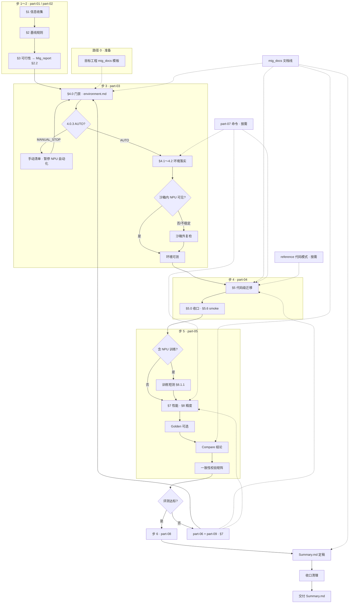

# 昇腾 NPU 迁移工作流（WorkFlow）

技能标识：**`science-model-npu-migration`**。本文件与 [SKILL.md](../SKILL.md)、[overview.md](overview.md) 及 [references/](part-01-scope-and-baseline.md) 分册对齐，描述 **使用前准备**、**完整迁移**与**快速检查**三条路径。

---

## 文档导航

| 文档 | 用途 |
|------|------|
| [overview.md](overview.md) | 快速开始、实战索引 |
| [SKILL.md](../SKILL.md) | 执行约定、分册索引 |
| **workflow.md**（本文件） | 流程、闭环、Mermaid、术语 |
| [deliverables-index.md](deliverables-index.md) | 目标工程交付模板 |

---

## 仓库结构

```text
science-model-npu-migration/
├── SKILL.md
├── manifest.json
└── references/
    ├── overview.md            # 快速开始
    ├── workflow.md            # 本文件
    ├── docs-index.md
    ├── environment-setup-objectives.md
    ├── deliverables-index.md  # 交付模板说明（复制 index + mig_docs/ 到目标工程）
    ├── part-01～09 + reference-code-patterns.md
    └── mig_docs/              # 目标工程交付模板（复制到待迁移仓库）
        ├── .gitignore
        ├── Summary.md
        └── working/
```

> **路径约定**：下文若写 `environment.md`、`Mig_report` 等短名，均指 **`mig_docs/working/`** 下同名文件；**`Summary.md`** 始终在 **`mig_docs/`** 根目录。

**分册一览**

| 类型 | 文件 | 角色 |
|------|------|------|
| 主线 1～6 | part-01～05、part-08 | 按执行步顺序 |
| 失败路径 | part-06、part-09 | 回滚 + 排障 |
| 按需辅助 | part-07、[reference-code-patterns.md](reference-code-patterns.md) | 命令模板、代码模式 |

---

## 路径 0：使用前准备

| 步 | 动作 | 参考 |
|:--:|------|------|
| 0.1 | 在**待迁移模型仓库**复制 `mig_docs/` 模板（含 **`.gitignore`**、`Summary.md` + `working/`）及 [deliverables-index.md](deliverables-index.md) | [deliverables-index.md](deliverables-index.md) |
| 0.2 | 可选：复制 [environment-setup-objectives.md](environment-setup-objectives.md) 到目标工程 `docs/` | [docs-index.md](docs-index.md) |
| 0.3 | 调用 `/science-model-npu-migration [框架] [芯片] [精度]` 或说明迁移需求 | [SKILL.md](../SKILL.md) |

> Skill 仓库内的 `mig_docs/` 为**模板**；迁移产出写在**目标工程**的 `mig_docs/`。

---

## 两条业务线（迁移过程中）

| 线 | 含义 | 落盘 |
|----|------|------|
| **主线** | 基线 → 可行性预判 → 门禁 → 代码级迁移 → 评测 → 归档 | 见「交付物映射」 |
| **文档线** | 与主线**并行**：自步 1 起维护目标工程 `mig_docs/` | `mig_docs/` + [`environment-setup-objectives.md`](environment-setup-objectives.md) |

**模板入口**：[deliverables-index.md](deliverables-index.md) · **环境目标**：[docs-index.md](docs-index.md)

---

## 主流程 § ↔ 分册

| 主流程 § | 分册 | 主题 |
|---------|------|------|
| §1～§2 | [part-01](part-01-scope-and-baseline.md) | 信息收集、基线 |
| §3 | [part-02](part-02-feasibility.md) | 可行性预判 |
| §4 | [part-03](part-03-environment.md) | 门禁与环境 |
| §5 | [part-04](part-04-code-migration.md) | 代码级迁移 |
| §7～§8 | [part-05](part-05-performance-accuracy.md) | 性能与精度 |
| §9 | [part-06](part-06-risk-rollback.md) | 风险与回滚（失败路径） |
| — | [part-08](part-08-checklist-deliverables-output.md) | Checklist、归档收口 |
| — | [part-07](part-07-commands.md) | 命令模板（按需） |
| — | [part-09](part-09-examples-troubleshooting.md) | 场景示例与排障（按需） |
| — | [reference-code-patterns](reference-code-patterns.md) | PyTorch/MindSpore 代码模式（按需） |

> **主流程无 §6**：skill 由 §5 直接进入 §7～§8。**`Mig_report` §6** 为交付模板「验证摘要」（part-04 smoke + part-05 短测/评测勾选），**不是**主流程 §6。

### 三套编号对照（执行步 · part · 主流程 § · 落盘）

| 执行步 | part | 主流程 § | 关键落盘 | 实战参考 |
|:--:|------|---------|----------|----------|
| 1 | part-01 | §1～§2 | `working/Compare` §2.1；`working/Mig_Readme` §3.1 | — |
| 2 | part-02 | §3 | `working/Mig_report` **§2.2** | — |
| 3 | part-03 | §4（§4.0 门禁） | `working/environment.md`、4.0.3；`working/Mig_report` §3 | part-07 环境验证 |
| 4 | part-04 | §5 | `working/Mig_report` §4～**§6**；`working/Mig_Readme` §4～§5 | part-04 §5.0～§5.7；reference |
| 5 | part-05 | §7～§8 | `working/Compare`；`working/Mig_report` §6 更新 | part-07 Golden/bench |
| 6 | part-08 | — | **`mig_docs/Summary.md`（最终交付）** | 闭环检查 + 矩阵 |
| 失败 | part-06 / part-09 | §9 | `working/Mig_report` **§7**、§8 | part-06 §9.4 模板 |
| 按需 | part-07 / reference | — | 命令与代码片段 | 不阻塞主线 |

**part 文件名编号 ≠ 执行顺序**：执行步 6 = **part-08**（归档）；**part-06** = 回滚。

---

## 完整迁移：执行顺序

| 步 | 分册 | 做什么 | 关键落盘 | 通过标准 |
|:--:|------|--------|----------|----------|
| 1 | part-01 | 信息、基线（日志优先 / 否则 GPU） | `working/Compare` §2.1；`working/Mig_Readme` §3.1 | 成功标准与数据集用途已书面化 |
| 2 | part-02 | 可行性预判（**不跑 NPU**） | `working/Mig_report` **§2.2** | 四块输出 + 预判结论 |
| 3 | part-03 | **§4.0 门禁** + 环境落实 | `working/environment.md`、4.0.3 | AUTO 或 MANUAL_STOP 已闭环 |
| 4 | part-04 | 代码级迁移 + smoke | `working/Mig_report` §4～§6；`working/Mig_Readme` §4～§5 | part-04 **§5.0 收口**（含 §5.6 smoke） |
| 5 | part-05 | 性能/精度、训练短测 §8.1.1 | `working/Compare`；`working/Mig_Readme` §2.6 | NPU 列先填；baseline 来源明确 |
| 6 | part-08 | 矩阵校验、汇总、定稿、清理 | **`mig_docs/Summary.md`** | part-08 Checklist 全勾 |

**辅助（不阻塞主线）**

| 分册 | 何时用 | 典型内容 |
|------|--------|----------|
| part-06 | 步 4/5 失败或评测未通过 | 回滚决策树、§7 模板、回流 part-03/04/05 |
| part-07 | 步 3～5 需要可复制命令 | set_env、单卡/HCCL、Golden、benchmark |
| part-09 | 与 part-06 配合排障 | 端到端场景 A/B/C、症状速查表 |
| reference | 步 4 PyTorch/MindSpore 改代码 | device 抽象、CUDA→NPU 表、训练 loop |

---

## 交付物映射（闭环对照）

| 层级 | 文件 | 主要填写阶段 | 核心章节 / 用途 |
|------|------|-------------|-----------------|
| **最终交付** | [`Summary.md`](mig_docs/Summary.md) | 步 6 | **唯一对外交付**；汇总 `working/` 与矩阵 8 项 |
| 过程 | [`working/environment.md`](mig_docs/working/environment.md) | 步 3 起 | 机器快照、沙箱内/外、**4.0.3 判定** |
| 过程 | [`working/Mig_report.md`](mig_docs/working/Mig_report.md) | 步 2～5 | §2.2 · §3 · §4～§6 · §7 · §8 |
| 过程 | [`working/Mig_Readme.md`](mig_docs/working/Mig_Readme.md) | 步 1、4～5 | §3 数据 · §4～§5 NPU 入口 · **§2.6 GPU baseline** |
| 过程 | [`working/Compare.md`](mig_docs/working/Compare.md) | 步 5 | NPU 列先填；baseline 日志 / GPU / N/A |

**测量顺序（步 5）**：NPU 落数 → baseline（**项目训练日志优先**，否则 **`Mig_Readme` §2.6 GPU 用户自测**）→ 定稿 `working/Compare` → 步 6 归档 `Summary.md`。

### 步 6 归档动作（part-08）

1. **矩阵校验（第二次）**：按下方「文档一致性校验矩阵」逐行核对 `working/` 与 `Summary.md`。
2. **汇总定稿**：从 `working/Mig_report`、`Compare`、`Mig_Readme`、`environment` 摘录写入 `Summary.md`；**勿**在 `Mig_report` 重复维护与 Summary 同内容的归档章节。
3. **文首快照必填**：baseline 来源、选用原因、环境、数据集、结论摘要（或失败勾选）。
4. **收口清理**：删除冗余/临时文件；保留 `Summary.md` + `working/` 过程记录。

### Summary.md 章节 ↔ 矩阵快查

| Summary 章节 | 矩阵校验项 / 数据来源 |
|-------------|----------------------|
| 文首快照 | baseline 来源 ← `Compare` §2.1 |
| §2 迁移操作总结 | 代码变更与启动命令 ← `Mig_report` §4～§5 |
| §3 迁移环境总结 | CANN / 驱动 / 框架 ← `environment.md` |
| §4.1 门禁 | 4.0.3 判定 ← `environment.md` |
| §4.2 预判与验证 | 可行性预判 ← `Mig_report` §2.2；smoke / 训练短测 ← `Mig_report` §6 |
| §4.3 数据集 | 数据集与测试用途 ← `Mig_Readme` §3.1 |
| §5 训练与推理效果 | 精度/性能数字 ← `Compare` §3～§4 |
| §6 问题与风险收口 | 失败/回滚 ← `Mig_report` §7～§8 |
| §7～§8（可选） | 下一步计划、签署交接（矩阵外扩展） |

---

## 闭环逻辑

```text
[路径 0] 目标工程 mig_docs 模板

part-01 基线
  → part-02 预判（Mig_report §2.2）
  → part-03 门禁（§4.0；MANUAL_STOP 暂停 NPU 自动化）
  → part-04 迁移 + smoke（§5.0 收口，含 §5.6 smoke；reference / part-07 按需）
  → part-05 评测
        · smoke 已在 §6 勾选（part-04）
        · 训练短测 loss↓30%～50%（§8.1.1，达标即停）
        · Golden / 全量精度性能 → Compare
  → 文档一致性校验矩阵（步 5 定稿 Compare 前）
  → part-08 同步 + 定稿 mig_docs/Summary.md
        · 文档一致性校验矩阵（步 6 归档前，第二次）
        ├─ 通过 → 收口清理 → 交付 Summary.md
        └─ 未通过 → part-06/09 → Mig_report §7 → 回流 part-03 / 04 / 05
```

**硬约束**

- part-02（怎么改）与 part-03（能不能跑）**不可互相替代**
- 不得跳过 part-03 **§4.0** 即建议 NPU 训练/推理
- **smoke** = part-04；**训练短测** = part-05 §8.1.1；**勿与 part-02 预判混淆**
- 沙箱内 `npu-smi` 失败时须沙箱外复检（part-03 §4.0.1）

---

## 闭环检查（任务结束前）

与 [part-08](part-08-checklist-deliverables-output.md) Checklist 对齐。

**阶段产物**

- [ ] 步 1～2：`working/Mig_report` §2.2、基线规则与 `working/Compare` §2.1 一致
- [ ] 步 3：`working/environment.md` 含 4.0.3；`working/Mig_report` §3 与快照互链
- [ ] 步 4：part-04 **§5.0 收口**（含 **§5.6 smoke**）；`working/Mig_report` §4～§6、启动命令、smoke 已勾选
- [ ] 步 5：`working/Compare` NPU 列已填；baseline 来源已注明；训练短测（若适用）未重复多轮
- [ ] 步 6：**`mig_docs/Summary.md` 已定稿**（文首快照 + 矩阵 8 项已回填）

**一致性**

- [ ] `Summary.md` + `working/` 四份过程文档关键字段无冲突（见下矩阵）
- [ ] 若曾失败/回滚：`working/Mig_report` **§7** + **§8** 已更新，且 `Summary.md` §6 已摘要
- [ ] 矩阵已在步 5（定稿 Compare 前）、步 6（定稿 Summary 前）各执行一次

**文档一致性校验矩阵**

> 短名 `environment.md`、`Mig_report` 等 = **`mig_docs/working/`** 下文件；`Summary.md` = **`mig_docs/`** 根目录。

| 校验项 | 权威来源 | 须同步到的文档 |
|--------|----------|----------------|
| 4.0.3 判定 | `environment.md` | `Mig_report` §3、`Summary.md` §4.1 |
| CANN / 驱动 / 框架插件版本 | `environment.md` | `Mig_report` §3、`Compare` §2.2、`Summary.md` §3 |
| 数据集与测试用途 | `Mig_Readme` §3.1 | `Mig_report` §2.1、`Compare` §2.4、`Summary.md` §4.3 |
| baseline 来源 | `Compare` §2.1 | `Summary.md` 文首快照 |
| 代码变更与启动命令 | `Mig_report` §4～§5 | `Mig_Readme` §4～§5、`Summary.md` §2 |
| 预判与验证 | `Mig_report` §2.2（可行性预判）、§6（smoke / 训练短测） | `Summary.md` §4.2 |
| 精度/性能数字与结论 | `Compare` §3～§4 | `Mig_report` §6、`Summary.md` §5 |
| 失败/回滚 | `Mig_report` §7～§8 | `Summary.md` §6；修复后回写 `Compare` |

**收口**

- [ ] part-08 Checklist 已逐项核对
- [ ] 冗余文档与临时缓存已清理（part-08 收口说明）
- [ ] 对话输出含 `mig_docs/` 路径与本轮更新文件列表

---

## 快速路径：仅检查 NPU 适配

| 项 | 说明 |
|----|------|
| **入口** | [part-03](part-03-environment.md) §4.0.0～4.0.3（+ 必要时 §4.1） |
| **产出** | `working/environment.md` + AUTO / MANUAL_STOP / UNKNOWN + 待补齐项 |
| **不进入** | part-04～05、完整 `Summary.md` 归档 |
| **回复要求** | 声明「本次为适配检查路径，未执行完整迁移链路」 |

完整迁移仍须从 part-01 起执行；使用前准备见「路径 0」。

---

## 工作流图（Mermaid）



---

## 节点 ↔ 分册

| 图中节点 | 分册 / 说明 |
|----------|-------------|
| `L0` | 目标工程 `mig_docs` |
| L1 `A` `B` `C` | part-01 §1～§2、part-02 §3 |
| L2 `D0`～`DS` | part-03 §4.0～4.2；[environment-setup-objectives](environment-setup-objectives.md) |
| L3 `H` `HV` | part-04 §5.0～§5.7 |
| L4 `ST` `J` `GD` `M` `MAT` | part-05；`MAT`=文档一致性矩阵 |
| `SYNC` `ARC` `CLN` | part-08；定稿 **`mig_docs/Summary.md`** |
| `N` | 步 5 末评测是否达标 |
| `P` | part-06、part-09 |
| `DOC` | 目标工程 `mig_docs/` 文档线 |
| `P7` | part-07 |
| `REF` | reference-code-patterns |

---

## 口径说明

### 术语（避免混用）

| 用语 | 含义 | 对应分册 / 落盘 |
|------|------|-----------------|
| **过程文档** | 步 1～5 维护的记录 | `mig_docs/working/` 下四份模板 |
| **最终交付** | 步 6 对外结论 | **`mig_docs/Summary.md`**（唯一） |
| **可行性预判** | 改代码前评估；**不跑 NPU** | part-02 → `working/Mig_report` §2.2 |
| **门禁 / 适配判定** | 机器与依赖能否跑 NPU | part-03 → `working/environment.md` 4.0.3 |
| **迁移后最小验证（smoke）** | 改码后 NPU 首次跑通 | part-04 → `working/Mig_report` §6 |
| **训练短测** | loss↓约 30%～50%，**达标即停** | part-05 §8.1.1 → `Summary.md` §4.2 / §5 |
| **全量精度/性能评测** | 数据集级指标与延迟/吞吐 | part-05 → `working/Compare.md` |
| **归档「预判与验证」** | 汇总 part-02 + part-03 + 迁移后验证 | `Summary.md` §4（§4.1～§4.3） |

### 约定

| 主题 | 约定 |
|------|------|
| **Skill 标识** | `science-model-npu-migration`；调用 `/science-model-npu-migration ...` |
| **范围** | 代码级迁移（PyTorch / MindSpore 等原生路径）；**不含** ATC/OM 转换与 AIR 离线部署 |
| **环境** | 目标 [environment-setup-objectives](environment-setup-objectives.md)；快照 **`mig_docs/working/environment.md`** |
| **可行 vs 门禁** | 预判「怎么改」（part-02）；门禁「能不能跑」（part-03 §4.0.3） |
| **baseline** | 项目完整训练日志优先；否则 **GPU**（`Mig_Readme` §2.6，用户自测） |
| **最终交付** | 步 6 定稿 **`mig_docs/Summary.md`**；过程文档在 `working/` |
| **失败留痕** | `Mig_report` §7.1 + §8 日志路径 |

---

## 相关文档

| 主题 | 路径 |
|------|------|
| 快速开始 | [overview.md](overview.md) |
| 最终交付模板 | [mig_docs/Summary.md](mig_docs/Summary.md) |
| 环境目标 | [environment-setup-objectives.md](environment-setup-objectives.md) |
| 代码迁移清单 | [part-04](part-04-code-migration.md) |
| 代码模式 | [reference-code-patterns](reference-code-patterns.md) |
| 命令模板 | [part-07](part-07-commands.md) |
| 场景与排障 | [part-09](part-09-examples-troubleshooting.md) |
| 回滚 | [part-06](part-06-risk-rollback.md) |
| Checklist | [part-08](part-08-checklist-deliverables-output.md) |
