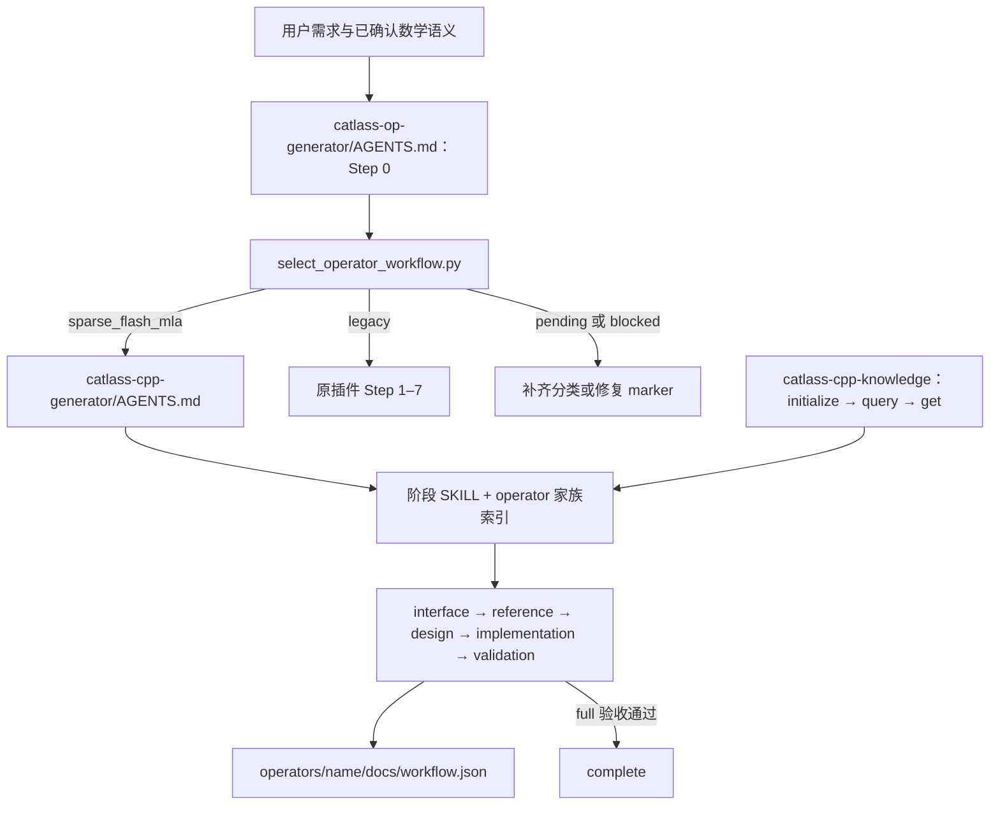

本页按主题合并知识；下列目录进入各主题的起点，各通用章节下保留完整细节。
通过知识工具 get 时使用文件路径，不把章节锚点传给 get。

- [五阶段路由与知识检索](#routing)
- [生成输入与实现起点](#entry)
- [调用材料与接口接线](#materials)

# 接口与概念

<a id="routing"></a>

<a id="routing--接口与概念"></a>

## 五阶段路由与知识检索

本文整理现有规则，不新增工作流阶段或验收要求。范围是 **SparseFlashMLA 普通 SWA 主算子 + 独立 metadata**，通用技术继续由五阶段 workflow 和 CATLASS 知识提供；本家族只补数学语义、接口、调度、资源、性能和验收中的特化信息。

整理基于 2026-09-24 本地仓库镜像。下文“阶段必读”来自阶段 SKILL 的显式要求，“索引命中”来自家族索引，“按需”取决于当前设计使用的组件或特性；这些分类不表示已经逐条审计每个子 agent 的阅读记录。`verified: []` 也不表示候选已通过设备或性能验收。

本知识家族位于 `knowledge/operator/sparse-flash-mla`。下文记 **G** 为工作流的 `catlass-cpp-generator` 根目录，**K** 为 `G/knowledge`。运行时知识副本位于工程的 `.catlass-cpp/knowledge/`；正文相对链接只引用知识包内文件，`G/...` 表示已安装插件的工作流入口，不相对运行时副本解析。

| 本次生成输入 | 调用要求 |
| --- | --- |
| 数学标杆 | 调用者给出实际文件；核对数学模式、入口、精度路径和 SHA256 |
| 原 ATK 适配 | 调用者给出实际脚本；核对输入生成、双标杆、比较器和执行入口 |
| 用例 | 调用者给出实际 JSON 与目标 `case_id`；核对 ID 与数组位置 |
| 手写性能基线 | 调用者给出覆盖目标 case 的可比报告；核对架构、输入身份、单位、计时范围和统计方式；只读 |
| 编译环境 | 目标机的 CANN 9.2.0-beta.2 环境；由部署方激活，不是 skill 文件依赖 |
| CATLASS 实现核对 | 先读工作流通用 CATLASS 知识和本家族组件边界，再在目标 checkout 中核对实际 API 签名与事件行为 |

前四项不是 skill 内置资源；每轮生成时将调用者给出的文件路径、SHA256 和适用范围写入工程记录。生成者使用这些输入及本包的特化知识，不读取手写 SparseFlashMLA 源码；验收时对比本轮候选与调用者提供的基线。

# 用法

<a id="routing--用法"></a>

## 五阶段路由与知识检索

普通 SWA 在 design/implementation/validation 的家族必读是：[任务流水与握手](pipeline.md#protocol)、[混合核结构与片上复用](pipeline.md#structure)、[源码与设备验收](validation.md#pipeline-validation)以及[通用工程交付](development.md#engineering)。入口是家族index和development，通用workflow继续提供阶段顺序与通用技术。

<a id="routing--路由顺序"></a>
## 路由顺序



1. 读取外层 AGENTS.md（`G/../AGENTS.md`） 的 Step 0。根据已确认的数学语义分类为 `sparse_flash_mla`；selector 不做自然语言理解，也不按名称猜测。
2. 调用 select_operator_workflow.py（`G/scripts/select_operator_workflow.py`）。已有合法 marker 优先；已有工程没有专用 marker 则走 legacy；新工程分类不足返回 pending；marker 不合法或不受支持返回 blocked。不能只加一个名字就把旧工程自动切到新流程。[^routing-routing]
3. 命中 `sparse_flash_mla` 后转入 五阶段 AGENTS.md（`G/AGENTS.md`），不继续执行 legacy Step 1–7。读取当前阶段 SKILL、[家族总索引](../index.md) 和 [SparseFlashMLA 索引](index.md)。[^routing-stages]
4. 新工程用 interface 初始化脚本建立 `operators/<name>/`；继续工程先校验 `docs/workflow.json`。`workflow_id=catlass-sparse-flash-mla-v1`，`algorithm_family=sparse_flash_mla`。
5. interface 冻结 `target_architecture=atlas_a2_a3`。当前迁移知识使用 910B/AtlasA2 的 `CATLASS_ARCH=2201`；不能因为通用工作流也支持 A5，就把 A5 的资源和执行模型带入本家族。

```bash
# 在 plugins-official/catlass-op-generator 下执行
python catlass-cpp-generator/scripts/select_operator_workflow.py \
  --workspace "{workspace_dir}" --operator-name "{operator_name}" \
  --algorithm-family sparse_flash_mla
```

<a id="routing--知识从哪里加载如何命中"></a>
## 知识从哪里加载、如何命中

内置知识源是 `G/knowledge/`，运行时查询的是工程的 `.catlass-cpp/knowledge/`。工具入口是 catlass-cpp-knowledge（`G/skills/catlass-cpp-knowledge/SKILL.md`）：

```bash
# 在 G/skills/catlass-cpp-knowledge 下执行
python scripts/record_knowledge.py initialize --project-root "{workspace_dir}"
python scripts/record_knowledge.py query --project-root "{workspace_dir}" \
  --family sparse_flash_mla --compact
python scripts/record_knowledge.py get --project-root "{workspace_dir}" \
  --path operator/sparse-flash-mla/computation.md
```

查询通过 vocabulary 将 `sparse_flash_mla` 映射到 `sparse-flash-mla` 家族，返回 concept 路径；再 `get` 读取选中的正文。`--text` 是对标题、说明、tags、路径和正文做大小写无关的词项匹配，不是自动推理式路由。family 过滤只返回本家族 concept；通用 `workflow/`、`catlass/` 要按阶段的显式路径或另外的组件查询读取。

**恢复旧工程时需要核对知识版本。** 当前 `initialize` 只复制缺失文件，对已有目标文件直接跳过；它不会自动把 skill 仓库的新正文覆盖到运行时副本。新一轮使用新 workspace 时可初始化最新 bundle；恢复旧工程时需比较本轮所用副本与内置源，记录采用的版本，不能仅凭再次 initialize 宣称加载了最新知识。[^routing-knowledge]

<a id="routing--五阶段与产物"></a>
## 五阶段与产物

| 状态 / 阶段 SKILL | 通用 workflow 知识 | SparseFlashMLA 补充 | 核心产物与进入下一阶段的依据 |
| --- | --- | --- | --- |
| interface / 接口（`G/skills/catlass-cpp-interface/SKILL.md`） | [接口与 Golden Contract](../../workflow/interface-and-golden-contract.md) | computation、interface、metadata；SWA 同时核对 interface 的一般 SWA 合法域 | `docs/api.md`、架构与 operator contract；依据已确认用户输入冻结 |
| reference / 标杆（`G/skills/catlass-cpp-reference/SKILL.md`） | 接口契约、[精度策略](../../workflow/precision-policy.md) | computation、validation、调用者提供的 golden/ATK；metadata 任务覆盖 | 唯一 `reference/reference.py`、definition、precision-policy；CPU 证据与 golden contract |
| design / 设计（`G/skills/catlass-cpp-design/SKILL.md`） | [完整设计参考](../../workflow/solution-design-reference.md)、[R01–R21](../../workflow/stage-design-rules.md)、[Stage/同步](../../workflow/kernel-stage-sync-patterns.md) | computation、interface、metadata、development、validation；SWA 同时完整读取 pipeline 和 performance，落实 development 的实现门槛 | 完整推演可存 `docs/design.full.md`；交付两章 `docs/design.md`，结构校验和设计评审均通过 |
| implementation / 开发（`G/skills/catlass-cpp-develop/SKILL.md`） | [开发与验证](../../workflow/development-and-validation.md)、实际 CATLASS 组件 | metadata、development、pipeline；BlockMmad 调用限制和主/metadata 接线 | 按 Stage 实现、编译、运行和比较；主核、metadata、wrapper、构建身份与定向精度记录 |
| validation / 测试（`G/skills/catlass-cpp-test/SKILL.md`） | 精度策略、开发与验证 | validation 的完整输出及流水验收、performance、调用者提供的可比性能基线 | `docs/validation.md`、原 ATK 报告、完整输出比较、性能原始样本；full 门禁通过才 complete |

工作流的 **stage** 是开发状态；设计中的 **kernel Stage** 是设备计算/同步阶段，两者不是一套编号。`catlass-cpp-knowledge` 是横向能力，不是第六阶段。跨会话以 `workflow.json` 保存状态，问题恢复使用 validator 支持的 `issue_type/resume_from/validation_scope` 组合。[^routing-stages]

<a id="entry"></a>

<a id="entry--sparse-flash-mla"></a>

## 生成输入与实现起点：Sparse Flash MLA

本家族包含 SparseFlashMla 主算子与独立的 SparseFlashMlaMetadata。先从用户给定的数学标杆、公开接口和目标架构确认模式，再进入本仓库 `catlass-cpp-generator/AGENTS.md` 的 interface → reference → design → implementation → validation 五阶段。当前迁移的硬件工程知识针对 Ascend 910B / AtlasA2（`CATLASS_ARCH=2201`）；其他架构需另行核对组件和资源。

调用者提供数学标杆、正式 ATK 脚本、用例文件和可比的手写性能基线；本知识包不固定这些文件的位置、内容或 case ID。开始前记录各文件的路径、SHA256、适用模式、目标架构和采样口径，核对标杆与 ATK 的输入/输出及比较器语义，再冻结本次验证范围。要求性能目标时，基线必须覆盖同一输入和计时边界；未提供可比基线时只报告候选实测值，不宣称达到相对性能目标。输入要求见[材料边界](workflow.md#materials)。不以手写算子源码为生成输入。

主算子及 metadata 的 ACLNN 声明已直接写入[接口知识](interface.md#api--5-aclnn-两段式-c-接口)；CATLASS 调用范围与同步封装的 SWA 约束写入[实现门槛](development.md#implementation)和[握手协议](pipeline.md#protocol)。专用目录不另提供可 include 的参考头文件或 SDK 源码快照；构建时仍以目标 SDK 的实际头文件和导出符号为准。

<a id="entry--必读契约"></a>
## 必读契约

- [生成路由、五阶段工作流与知识命中](workflow.md#routing)
- [数学、窗口/压缩/索引和共同 softmax](computation.md)
- [主算子及 metadata 的完整接口和参数对应](interface.md#api)
- [独立 metadata 调度表、生产/消费协议](metadata.md)
- [Stage、同步、资源和构建](development.md#stages)
- [精度、功能和性能验收](validation.md#coverage)

<a id="entry--普通-swa"></a>
## 普通 SWA

- **design、implementation、validation 必须完整读取**：[任务流水与逐事件握手](pipeline.md#protocol)、[混合核结构与片上复用](pipeline.md#structure)、[源码与设备验收](validation.md#pipeline-validation)。三者给出普通域唯一必读的组织方式；资源、tile 和边界都必须按运行时参数重算。
- **实现PV尾块时读取**：[有效K、物理对齐、行距与逐阶段参数](pipeline.md#structure--pv-tail)、[通用边界验收](validation.md#pipeline-validation--pv-tail-validation)。尾块规则是通用约束，不依赖某个固定样例或历史诊断文件。
- [完整合法域、stride、PA、零工作与 LSE](interface.md#swa-contract)
- [实现起点、共享 KV 工作量与可核对的 CATLASS MLA 示例](development.md#implementation)
- [主核和 metadata 工程、正式部署闭环](development.md#engineering)
- [decode/prefill/尾块策略与动态调度](performance.md#strategy)
- [定向精度、诊断 ABI 与原 ATK 边界](validation.md#suite)
- [连续短窗口 prefill 性能推导](performance.md#prefill)

用例、诊断、性能评价、状态模型与构建准备均以知识配方提供，按需在本轮工程内实现。性能评价读取调用者给出的基线、用例和本轮候选采样；诊断读取调用者给出的标杆与用例。这些检查不能代替原 ATK 或正式接口验收。用户只指定普通 SWA 时，不要求实现压缩和索引模式；metadata 仍必须由本轮工程独立实现并被主核消费。

[双槽握手参考模型](pipeline.md#model-usage)可辅助理解三actor启动、稳态与排空。它只验证参考程序，不能自动验证生成者源码或NPU流水；实际实现仍须按源码映射模型并完成设备验收。

诊断和性能评价必须显式选择所需 case_id 或全部用例，未选择时拒绝运行；不能默取前十条或把数组位置当作 case_id。缺任一条不能宣布子集通过。

<a id="materials"></a>

<a id="materials--调用输入与材料边界"></a>

## 调用材料与接口接线：调用输入与材料边界

每次调用由调用者提供实际文件，不从本知识包推断服务器路径或自动选用旧样本。开始前检查文件可读，记录绝对路径、SHA256、版本与本轮任务身份；生成工程可保存本轮输入副本和哈希，但不得回写本知识包。

| 调用输入 | 核对要求 | 用途 |
| --- | --- | --- |
| 数学标杆 | 入口、模式、输入量化、输出及 LSE 轴序 | 冻结本轮数学语义和 CPU 参考 |
| 正式 ATK 脚本 | 与标杆和用例的接线、比较器及原始阈值 | 正式精度验收；诊断脚本不能代替 |
| 用例文件 | schema、真实 `case_id`、dtype/布局/shape 和选中范围 | 覆盖本轮普通 SWA 输入；不能按数组位置冒充 ID |
| 手写性能基线 | case 身份、设备架构、主核计时边界、单位和采样统计 | 逐例计算速度比；不重跑已提供的基线 |

若任一输入缺失，继续不依赖该输入的工作，并把对应验收标为 NOT_RUN；不要从固定机器路径、旧工程或本包历史数据补齐。性能基线缺失或不可比时，不能宣布相对性能 PASS。参考脚本只能作为本轮输入读取，不作为 skill 的永久资源。

本包只保留[接口调用约束](workflow.md#materials--接口参考)。ACLNN 声明已经内嵌在[接口知识](interface.md#api--5-aclnn-两段式-c-接口)，CATLASS 组件使用边界由专用知识补充；目标机器的 CANN/CATLASS 头文件、库和编译器仍须在构建时校验 ABI。

# 代码模式

<a id="routing--代码模式"></a>

## 五阶段路由与知识检索

<a id="routing--算子算法"></a>
## 算子算法

| 专用知识 | 命中条件 | 补充的决策 |
| --- | --- | --- |
| [computation.md](computation.md) | interface/reference/design 显式读取 | 普通窗口、压缩、索引的数学区分；QK、共同 softmax、sink、PV、O/LSE；本任务只实现普通 SWA |
| [interface.md](interface.md#api) | interface/design 显式读取 | 主算子 28 个 Python 参数、metadata 27 个参数、可选槽、两返回值和调用映射 |
| [一般 SWA 合法域](interface.md#swa-contract) | 普通 SWA interface/design 显式读取 | 910B 已确认支持域；BSND/TND/PA、有效长度与存储偏移、stride、零输出、sink 和 LSE |

普通 SWA 以每行真实可见集合计算；sink 影响共同分母，不增加一个输出 value。精度路径和 cast 顺序从本轮冻结的 golden 契约确定。调用者给出的回归子集不能自动缩小已承诺的普通 SWA 合法域。[^routing-swa-contract]

<a id="routing--分核策略与基本块切分"></a>
## 分核策略与基本块切分

| 专用知识 | 命中条件 | 补充的决策 |
| --- | --- | --- |
| [metadata.md](metadata.md) | interface/design/develop 显式读取 | 独立生成 INT32[1024]、FA/FD 游标区、禁用核与保留字初始化、任务完整覆盖、主核消费 |
| [实现起点与工作量检查](development.md#implementation) | 普通 SWA 索引命中；写主核前读取 | `H=N1/N2`、跨 query 的 `T`、`M=T*H`、共享 KV 的物理 N；工作量和组件调用门槛 |
| [一般 SWA 分支与性能](performance.md#strategy) | SWA design 显式读取 | decode/prefill、尾块、动态调度、数据复用和核间负载 |
| [连续短窗口 prefill 推导](performance.md#prefill) | 长 prefill 按需 | 连续短窗口的 KV 重用与搬运量推导 |

需要同时区分 metadata 的逻辑游标块、主核逻辑 M/N 任务以及一次 BlockMmad 的 m/n。跨 query 后 KV 并集最多为 `128+T-1`，物理 score/P stride 可能超过 128；BlockMmad 仍要求每次调用的 M/N 不超过 L1 tile，外层 scheduler 必须负责分块。具体资源表与地址公式见实现门槛页，不在本地图维护第二份参数表。[^routing-swa-gates]

<a id="routing--数据路径与存储层级"></a>
## 数据路径与存储层级

| 知识层 | 文件 | 本场景使用方式 |
| --- | --- | --- |
| 通用 CATLASS | [BlockMmad](../../catlass/block-mmad.md)、[CopyAtom](../../catlass/copy-atom.md)、[DispatchPolicy](../../catlass/dispatch-policy.md) | 按组件查询；确定计算块、搬运和策略后回到固定源码核对签名 |
| 通用 CATLASS | [GemmUniversal](../../catlass/gemm-universal.md)、[Epilogue](../../catlass/epilogue.md)、[Swizzle](../../catlass/swizzle.md) | 仅在实际方案采用这些组件时读取；不是所有 SWA 方案必读 |
| 专用开发 | [development.md](development.md#stages) | 家族 Stage、共享 KV 数据流、L1/L0/UB/workspace 和同步职责 |
| 专用工程 | [动态工程与正式部署](development.md#engineering) | 参数寻址、有效长度、PA、metadata 与主核职责、正式交付和候选身份 |
| 专用组件边界 | [实现起点与工作量检查](development.md#implementation) | BlockMmad 的单块范围、外层 M/N scheduler、真实 stride 与排空；目标 checkout 核对真实签名 |
| 专用同步约束 | [双槽跨任务握手](pipeline.md#protocol) | CrossCore token、反向握手、两个 AIV 的参与条件；目标 SDK 核对 mode/PIPE/编号 |

通用 workflow 负责 Stage 分析、同步和开发方法；专用知识补上 SWA 的行映射、KV 并集、页表和 metadata 表。资源与 API 结论仍要以当前 checkout、编译参数和目标设备为准。[^routing-swa-engineering]

<a id="routing--流水排布同步关系与数值精度"></a>
## 流水排布、同步关系与数值精度

| 专用知识 / 工具 | 命中条件 | 用途和边界 |
| --- | --- | --- |
| [validation.md](validation.md#coverage) | reference/design/validation | 基础功能、metadata/主核组合、精度和性能规则 |
| [动态诊断 ABI 与完整输出](validation.md#suite) | 普通 SWA validation | 原 ATK、完整 O/LSE、动态输入、诊断 ABI、同轮缓存、性能与构建身份 |
| [动态工程与正式部署](development.md#engineering)、[双槽跨任务握手](pipeline.md#protocol)、[流水源码与设备验收](validation.md#pipeline-validation) | 设计、实现、正式交付和验收 | 统一承载两种 launcher、workspace 所有权、AICPU 真实执行链、握手与设备边界；所有 shape 按运行时参数重算 |
| [工程诊断运行器](validation.md#diagnostics) | 独立诊断 | direct C ABI、输入/输出/metadata、ABAB 与设备采样；不能自动填为正式 ATK PASS |
| [性能证据评价步骤](performance.md#acceptance) | 性能验收汇总 | 读取冻结基线和本轮候选证据；不生成候选的设备通过证据 |
| 调用者提供的性能基线 | 性能验收 | 与所选用例逐例配对；缺失或不可比时不报告相对性能 PASS |

<a id="materials--接口参考"></a>

## 调用材料与接口接线：接口参考

两个算子的完整 ACLNN 函数声明直接写在[接口知识 §5](interface.md#api--5-aclnn-两段式-c-接口)中，只用于冻结参数顺序与调用关系；本知识包不提供可被工程直接 include 的头文件。目标 CANN SDK 的真实头文件和导出库必须在构建时再次检查，不能仅凭知识页宣称 ABI 已验证。

<a id="materials--公开符号"></a>
## 公开符号

- `aclnnSparseFlashMlaGetWorkspaceSize`：主算子参数检查、输出描述和 workspace/executor 规划。
- `aclnnSparseFlashMla`：主算子执行入口，接收 workspace、workspace size、executor 和 stream。
- `aclnnSparseFlashMlaMetadataGetWorkspaceSize`：metadata 参数检查、输出描述和独立 workspace/executor 规划。
- `aclnnSparseFlashMlaMetadata`：metadata 执行入口，接收自己的 workspace、workspace size、executor 和 stream。

主入口与 metadata 入口各自拥有两段式调用，不能共享 executor，也不能把 metadata 变成只在主核内部调用的私有辅助函数。

<a id="materials--aclnn-tensor-访问边界"></a>
## ACLNN tensor 访问边界

正式 host 适配需要从目标 SDK 的 `aclTensor` 取得 view shape、view strides、view offset、逻辑数据地址、存储首地址和 placement。本包把这些调用关系固定为以下规则，生成代码不需要依赖包外的接口源文件来猜测语义：

- shape/stride 必须来自 view 描述；不能用 storage shape 或连续布局假设替代。
- `GetData()` 表示逻辑 view 的首元素地址；`GetStorageAddr()` 表示底层 storage 首地址。若使用前者，不得再次叠加 view offset。
- 设备 kernel 只接收已经验证过的 device placement 和定长 shape/stride 描述；host 侧不得把 host tensor 地址当作 device pointer。
- 目标 CANN 版本的真实头文件、枚举值和导出符号只在构建/加载阶段复核，复核结果应记录在工程 validation evidence 中，而不是把 SDK 头文件当作本知识包的隐含依赖。

<a id="materials--调用顺序"></a>
## 调用顺序

1. 准备输入 tensor、布局/长度/页表/窗口/TopK 等属性，并创建 metadata 输出 tensor。
2. 调用 `aclnnSparseFlashMlaMetadataGetWorkspaceSize`，分配 metadata workspace，执行 `aclnnSparseFlashMlaMetadata`。
3. 在同一 stream 上保持 metadata 完成依赖，把 metadata tensor 传给主算子。
4. 调用 `aclnnSparseFlashMlaGetWorkspaceSize`，分配主算子 workspace，执行 `aclnnSparseFlashMla`。
5. 保持 tensor、workspace、executor 和 stream 依赖直到设备完成；workspace size 为零时遵循目标 SDK 的接口要求。

metadata 的输入属性必须与主算子一致；当长度、TopK、mask、页表或布局改变时重新生成 metadata。主输出为 attention output 和可选 LSE；metadata 输出为固定容量的 INT32 任务表，具体形状和保留位以 `../metadata.md` 为准。

<a id="materials--相关知识"></a>
## 相关知识

- 参数、shape、dtype、layout 和两个返回值：`../interface.md`
- metadata 游标、保留位和写入协议：`../metadata.md`
- 文件清单与用途：[调用输入与材料边界](workflow.md#materials--调用输入与材料边界)

# 约束

<a id="routing--约束"></a>

## 五阶段路由与知识检索

- **通用与专用边界：** 通用编译、Stage、同步、精度策略和恢复流程引用既有 workflow；SWA 数学、metadata、地址/stride、资源推导和性能特化放在本家族目录。不要将 Linear Attention 的矩阵求逆知识引入不涉及该数学的 SWA。
- **交付形式与验收：** 正式 ACLNN/AICPU 包和契约允许的 PyTorch/直调成对工程要区分。前者必须具备自己的注册、AICPU 实现和两段式接口；后者也要有独立可调用的真实 metadata 与完整主入口。不能借用环境中已有算子，也不能只凭内部诊断符号或安装成功宣称原 ATK 通过。[^routing-swa-engineering]
- **更新规则：** 本文只作为导航，算法、接口和阈值分别以链接到的权威页为准；修改通用规则不在本页另建一套，阶段门禁仍由 SKILL 和状态校验器维护。

# 失败表现

<a id="routing--失败表现"></a>

## 五阶段路由与知识检索

| 现象 | 应回查的知识和证据 |
| --- | --- |
| 仓库已更新，子 agent 仍按旧知识生成 | 核对 `.catlass-cpp/knowledge` 与 bundle；initialize 不覆盖已有文件 |
| 只完成 CPU/planner/metadata，未执行主核 | 实现门槛与 engineering；metadata 后做真实主核 smoke，检查成对交付 |
| 内部库/ELF 成功，正式入口执行失败 | interface、engineering；若选 ACLNN/AICPU，查通用工程页的注册、binary info、AicpuTaskSpace 与加载检查 |
| BlockMmad 首次同步超时 | implementation-gates；先查外层 M/N 分块、物理 stride、事件生命周期和排空，单纯改核数不能证明修复 |
| direct diagnostics PASS，但没有原 ATK 或 LSE 证据 | validation 的动态诊断及正式验收边界；保持相应正式门禁 NOT_RUN，不能等同已通过 |
| 选定用例精度通过，但性能未达标 | 按测试阶段 SKILL 的性能优化恢复流程继续验证；按 profile 和共享 KV 工作量修正方案 |

# 验证方法

<a id="routing--验证方法"></a>

## 五阶段路由与知识检索

本页是导航文档：检查路径、bundle schema、索引和检索可达性即可；文档检查不能代替设备测试。实际候选仍按以下已有门禁验收：[^routing-swa-validation]

1. 验证 `workflow.json` 的 family、workflow ID、架构、契约和阶段。接口/golden 改变时回到对应阶段，设计假设改变回 design；性能失败不新增 optimize 阶段。
2. 在目标环境真实调用本轮 metadata 与 main，确认完整输出、当前输入/长度/页表、候选构建身份；原 ATK 使用原测试和阈值，O/LSE 按契约全面检查。
3. 明确选中调用者给出的真实 `case_id`。诊断与性能评价都必须显式选择真实 case_id；不传选择集合或全部用例选项时拒绝运行。保留完整合法域所需的补充边界验证，不以某一子集代替所有功能。
4. 候选每例 **5 次预热 + 5 次正式采样，全部 5 条取均值**。计入完整 main 调用需要的 device tasks；metadata 生成时间另记。通过正式入口采集，并保留 profile 原始行和候选身份；direct C ABI 采样仍标为诊断。
5. 按冻结手写基线逐例比较：`speedup = baseline_us / candidate_us >= 0.8`，即候选均值 `<= baseline_us / 0.8`。不重跑手写基线，不用跨 case 平均值掩盖失败。
6. 单例运行 60 秒无返回按工作流记录 timeout、Stage、TilingKey、blockDim，并清理再恢复；未完成和未运行的门禁如实保留。只有 full 功能、精度和要求的性能证据齐全才 complete。

[^routing-routing]: 选择器源码（`G/scripts/select_operator_workflow.py`）与外层 Step 0（`G/../AGENTS.md`）。
[^routing-stages]: 五阶段 AGENTS.md（`G/AGENTS.md`）及各阶段 SKILL。
[^routing-knowledge]: record_knowledge.py（`G/skills/catlass-cpp-knowledge/scripts/record_knowledge.py`）的 `initialize`、`query_bundle` 和 `_canonical_family`。
[^routing-swa-contract]: [普通 SWA 契约](interface.md#swa-contract)。
[^routing-swa-engineering]: [工程与交付边界](development.md#engineering)及 [metadata](metadata.md)。
[^routing-swa-gates]: [实现门槛与 BlockMmad 外层分块](development.md#implementation)。
[^routing-swa-validation]: [诊断、原 ATK 和性能采集边界](validation.md#suite)。
