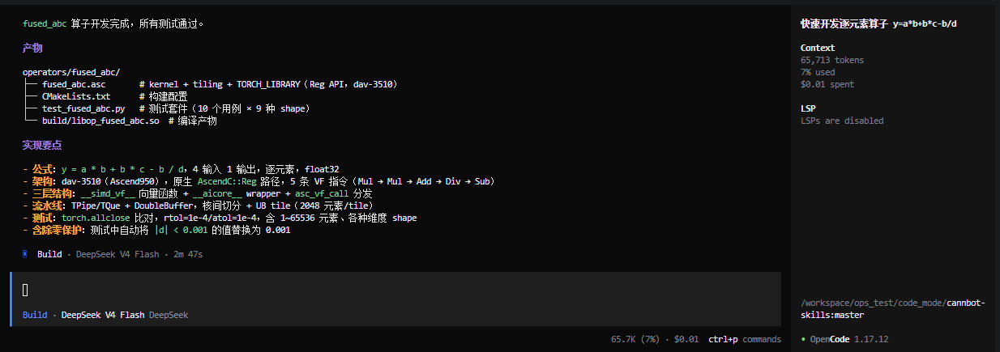
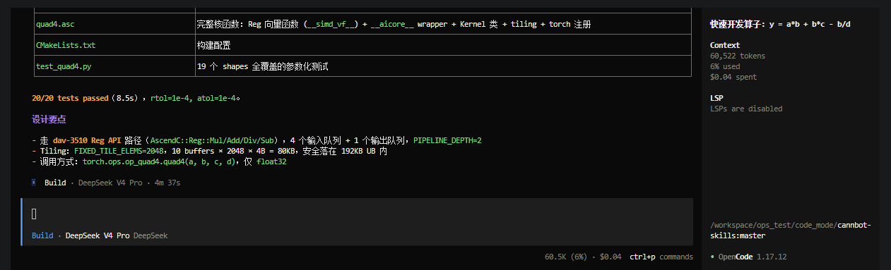
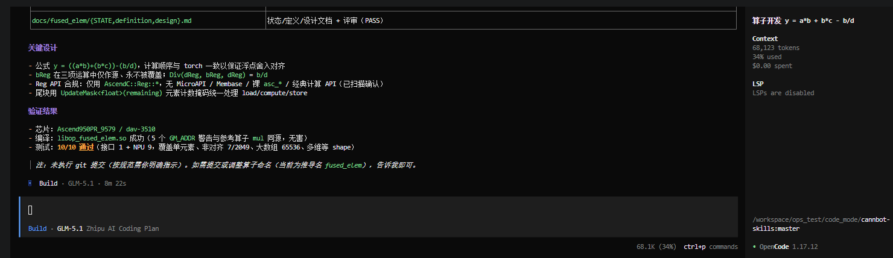
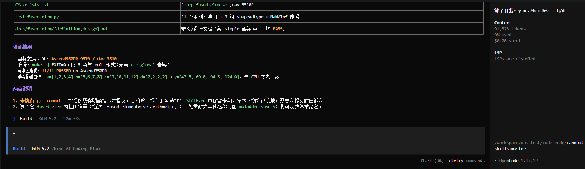
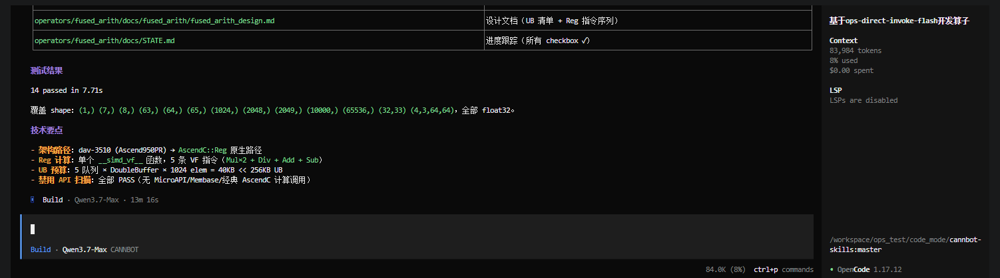

# ops-direct-invoke-flash

Ascend C 算子开发工具 **CANNBot（Flash 版）**。从 CPU 函数、数学公式、代码片段或文本描述出发，端到端构建并验证一个高性能 Ascend NPU 核函数。

## 能力概览

完整工作流覆盖：环境探测 → 定义/设计文档 → 增量实现 → NPU 验证 → 收尾文档。

## 安装

使用仓库内的 `init.sh` 将 skill、agent 与配置以软链接方式安装到目标工具。

```bash
# 在当前项目中为 opencode 安装
./init.sh project opencode

# 全局安装到 opencode（~/.config/opencode）
./init.sh global opencode
```

## 使用

安装后在对应工具中触发 skill，并提供算子来源：

```
/ops-direct-invoke-flash 开发一个 Abs 算子
```

默认在 `operators/` 目录下开发。仓库已内置 `operators/add`、`operators/mul`、`operators/sqrt` 作为结构参考。

## 快速体验

也可以直接克隆仓库，用 opencode 加载 `plugins-official/ops-direct-invoke-flash` 快速开发一个算子。

**第 1 步：拉取代码**

```bash
git clone https://gitcode.com/cann/cannbot-skills.git
```

**第 2 步：进入目录**

```bash
cd cannbot-skills
```

**第 3 步：打开 opencode**

```bash
opencode
```

**第 4 步：输入提示词**

在 opencode 中给出算子规格即可开始开发：

```
使用 plugins-official/ops-direct-invoke-flash 快速开发一个算子。
## 算子规格
- 公式：y = a * b + b * c - b / d
- 输入：a、b、c、d，共 4 个，逐元素（elementwise）运算，同 shape
- 输出：y
- 数据类型：float32
```

## 多模型实测

使用上述「快速体验」提示词，在 opencode（v1.17.12）+ Ascend950PR（dav-3510）环境下，用 5 个模型分别端到端开发该算子，全部一次通过编译与真机精度测试。端到端耗时如下（按耗时升序）：

| 模型 | 端到端耗时 | 上下文消耗 | 测试结果 |
| --- | --- | --- | --- |
| DeepSeek V4 Flash | **2m 47s** | 65.7K tokens | 全部通过（10 用例 × 9 种 shape） |
| DeepSeek V4 Pro | 4m 37s | 60.5K tokens | 20/20 通过 |
| GLM-5.1 | 8m 22s | 68.1K tokens | 10/10 通过 |
| GLM-5.2 | 12m 33s | 91.3K tokens | 11/11 通过 |
| Qwen3.7-Max | 13m 16s | 84.0K tokens | 14/14 通过 |

> **说明**：以上耗时仅为单次实测参考值，并非绝对指标。端到端耗时受大模型推理速度、网络状况、机器负载、模型生成路径等多重因素影响，不同时间、不同环境下复测结果会有波动。

<details>
<summary>各模型运行截图（点击展开）</summary>

**DeepSeek V4 Flash — 2m 47s**



**DeepSeek V4 Pro — 4m 37s**



**GLM-5.1 — 8m 22s**



**GLM-5.2 — 12m 33s**



**Qwen3.7-Max — 13m 16s**



</details>
