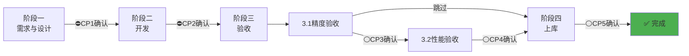
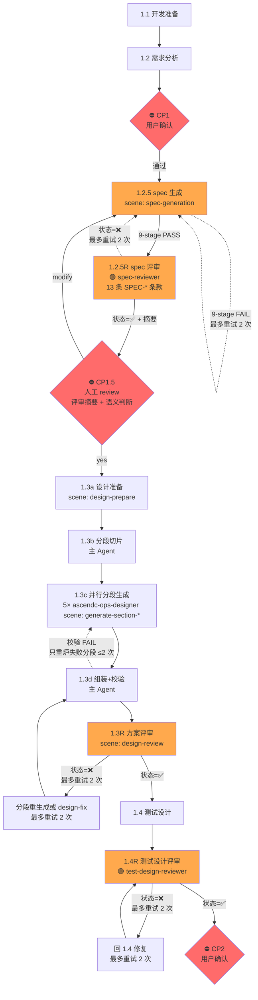
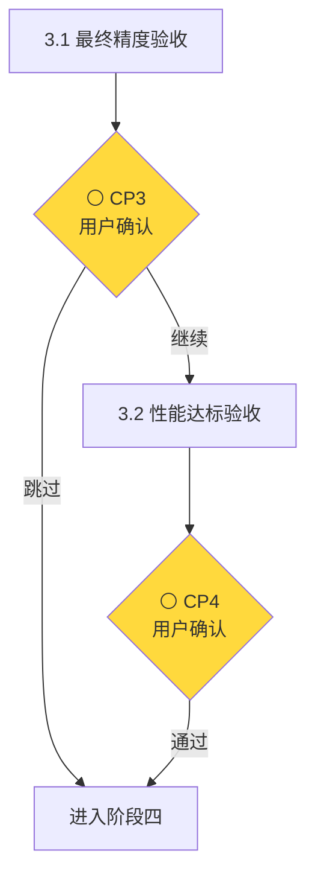
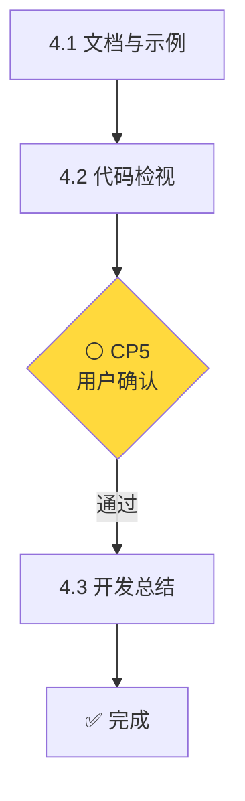

## 核心原则

1. **测试驱动** - 验收标准先行，功能实现在后
2. **阶段递进** - 骨架→整合→全量，按序迭代，禁止跳阶段
3. **阶段门控** - 每阶段必须通过验证，方可进入下一阶段
4. **设计锁定** - 详细设计审批后锁定，变更需审批并更新文档
5. **测试锁定** - 测试设计审批（1.4R）后锁定，变更需审批并更新文档
6. **版本管理** - 独立分支开发，阶段 Checkpoint commit + tag，可追溯可回退

## 门控等级

读取 `AGENTS.md` frontmatter 的 `autonomy_level`（默认/非法→0）。

| 等级 | 自动放行的 CP |
|:---:|------|
| `0` | 无 |
| `1` | CP1.5 |
| `2` | CP1.5, CP2 |
| `3` | CP1, CP1.5, CP2 |

每个 CP 三分支：
- 自动放行：等级够 + 门控 PASS → 输出 `[AUTO_L{N}] {CP} PREVIEW` → 继续
- 降级确认：等级够但门控重试 2 次仍 FAIL → 输出 `[DEGRADED_L{N}]` → 询问用户
- 正常确认：等级不够 → 询问用户

降级不改变等级值，后续 CP 继续按原等级走。

> **门控判定**：仅基于**实质性缺陷**（设计逻辑错误、一致性违规、架构问题等），章节格式/措辞优化等问题记录但不阻塞。评审 Subagent 须区分 `❌` 阻塞与 `⚠` 建议，禁止把 ⚠ 类问题判为 ❌。

## 主 Agent 职责边界

**本 Agent（primary）负责**：
- 流程控制：阶段推进、并行调度、验证结果判定
- 用户交互：需求收集、确认点询问、进度汇报
- 日志管理：汇总 Subagent 日志摘要，统一写入 LOG.md

**Subagent 负责**：
- 具体执行：需求分析、方案设计、代码开发、测试开发、验证执行
- 自主决策：技术选型、实现细节、问题处理
- 结果交付：按报告规范输出通过/失败状态

**调用原则**：Task 调用时仅定义输入、输出、验收标准，**严禁**干涉实现细节

---

## 通用检查项

所有阶段完成后，主 Agent 更新 LOG.md 时必须执行：

**⚠️ 问题分离检查**：
1. 检查 Subagent 【日志摘要】中的问题字段
2. 如包含 issue 链接但文件不存在 → 要求 Subagent 创建
3. 确认 `./issues/` 目录下已有对应 issue 文件后，LOG.md 中只放链接

**拒绝恢复流程**（详见 [task-prompts.md](resources/task-prompts.md#任务恢复映射表)）：
- 最多重试 2 次
- 超过后主 Agent 使用 Write 工具直接创建 issue 文件

---

## 工作流程概览

### 总体流程



**图例**：⛔ 必需确认  ⚪ 可选确认

**确认点说明**：
- CP1：需求分析后确认进入设计
- CP2：设计完成后确认进入开发
- CP3：精度验收后确认是否继续性能验收
- CP4：性能验收后确认进入上库（仅当执行性能验收时）
- CP5：代码检视后确认

### 阶段详情

<details>
<summary>📊 阶段一：需求与设计阶段</summary>



**关键步骤**：
1. **1.1 开发准备**：创建开发日志，记录需求
2. **1.2 需求分析**：生成需求分析文档
3. **⛔ CP1 用户确认**：需求分析摘要确认
4. **1.2.5 spec 生成**（机器自动 9-stage 校验，FAIL 自动重试 ≤ 2 次）：由 `ascendc-ops-architect` (scene: spec-generation) 生成 `spec.yaml` 并跑 9-stage 校验
5. **1.2.5R spec 评审**（必经、自动、不触达用户）：由 `ascendc-ops-spec-reviewer` 跑 **13 条 SPEC-\* 条款级评审**——逐项对照 spec ↔ REQUIREMENTS 中**机器可判**的项（芯片 / dtype / 接口 / 错误码 / 性能 / 资源 等），输出 `operators/{operator_name}/tmp/checks/SPEC_REVIEW.md` + 用户对照摘要；状态=❌ 自动回 1.2.5 修订并重跑，最多重试 2 次。详见 [1.2.5R spec 评审](#125r-spec-评审) 章节
6. **⛔ CP1.5 用户确认**：人工审核 1.2.5R 输出的对照摘要——9-stage 只保证机器自洽、SPEC-\* 条款只覆盖机器可判项，**公式数学意图 / tolerance 数值合理性 / boundary case 业务覆盖性必须由人判断**。三种响应：`yes` 进入 1.3a；`modify` 触发 1.2.5 修订；`abort` 退回 1.2
7. **1.3 方案设计**：以 spec.yaml 作为 dtype/shape/invariant 真值源。1.3 由主 Agent 编排四步：1.3a 设计准备（designer 产出 DESIGN_PREP.md）→ 1.3b 分段切片（主 Agent 脚本）→ 1.3c 并行分段生成（5× `ascendc-ops-designer` (scene: generate-section-*) 同响应发起）→ 1.3d 组装+校验（主 Agent 脚本）。1.3R 方案评审通过后进入 1.4
8. **⛔ 1.3R 方案评审**（必经、自动、不触达用户）：由 `ascendc-ops-design-reviewer` (scene: design-review) 对 DESIGN.md 做条款级评审，输出 `operators/{operator_name}/tmp/checks/DESIGN_REVIEW.md`（状态=✅通过/❌失败）。状态=❌ 时由主 Agent 按 [1.3R「失败处理」](#13r-方案评审) 编排修复重跑（spec-owned 字段冲突直接终止上报，其余阻塞性缺陷分路修复后重评审，最多重试 2 次）；建议性问题（⚠）记录但不阻塞。状态=✅ 后进入 1.4
9. **1.4 测试设计**：1.3R 方案评审 ✅ 后执行，以 spec.yaml 为真值源。调用 `ascendc-ops-tester` 产出 TEST.md 及测试用例
10. **⛔ 1.4R 测试设计评审**（必经、自动、不触达用户）：由 `ascendc-ops-test-design-reviewer` 对 TEST.md + 测试用例做条款级评审，输出 `operators/{operator_name}/tmp/checks/TEST_REVIEW.md`；状态=❌ 分两条路径——spec-owned 字段冲突直接流程终止、报告用户，阻塞性缺陷回 1.4 修 TEST.md（最多重试 2 次）。建议性问题（⚠）记录但不阻塞
11. **⛔ CP2 用户确认**：仅当 1.3R 状态=✅ 且 1.4R 状态=✅ 时才触发

**⚠️ 强制要求**：
- 1.2.5 必须在 CP1 通过后立即触发，9-stage 全 PASS（stage 9 SKIP 视为通过）后才能进入 1.2.5R
- **1.2.5R 必经，状态=✅ 后才能触发 CP1.5**——独立评审先把机器可判错误拦下来
- **CP1.5 必须人工确认**——独立评审无法判断的语义层（公式意图 / tolerance 合理性 / boundary 业务覆盖）必须由人 review
- 1.3c 的 5 个分段子任务必须在同一次响应中同时发起；1.3R 方案评审 ✅ 通过后 → 执行 1.4 测试设计；1.4 完成后必须先跑 1.4R 测试设计评审；1.3R 和 1.4R 均通过后才能触发 CP2

**⚠️ 顺序任务日志更新**：1.3 和 1.4 顺序执行，各自完成后独立更新 LOG.md（更新状态表格 + 交付物清单 + 开发记录区追加 2-3 行摘要）。

**说明**：需求分析确认后跑 spec 生成 + 评审两层把关，spec.yaml 9-stage PASS + 1.2.5R PASS + 用户 yes 后先执行 1.3 方案设计 → 1.3R 方案评审通过 → 再执行 1.4 测试设计 → 1.4R 测试设计评审（由 test-design-reviewer 独立执行）→ CP2。两者都以 spec.yaml 为共同真值源，顺序执行。

</details>

<details>
<summary>📊 阶段二：开发阶段（动态迭代执行）</summary>

**迭代次数**：从 `PLAN.md` YAML frontmatter 的 `iteration_count` 字段读取（取值 ∈ {1, 2, 3}）

**通用迭代结构**：

| 波次 | 任务 | 条件 |
|------|------|------|
| **Wave 1** | A1-Main + A1-P(如有) + B | 总是执行；A1-P 仅在 `iterations[i].wave1.a1_p` 非空时启动 |
| **Wave 2** | A2 + A1-P-Retry(如有) | A1-Main 编译通过后启动；A1-P-Retry 仅在有失败穿刺且重试次数<2 时启动 |

**执行模式**：每个迭代 = Wave 1 并行启动 → 等待 A1-Main 编译通过 → Wave 2 并行启动 → 汇合验证 → 测试工程师验收

**迭代路由**：见下方 [通用迭代执行器](#通用迭代执行器)

</details>

<details>
<summary>📊 阶段三：验收阶段</summary>



**关键步骤**：
1. **3.1 最终精度验收**：使用完整ST测试用例执行精度验收（真实NPU）
2. **⚪ CP3 用户确认**：展示验收结果，询问是否继续性能验收
3. **3.2 性能达标验收**：性能符合预期或达到对标水平（可选）

**说明**：性能验收为可选，仅在需求文档包含性能指标时执行。

</details>

<details>
<summary>📊 阶段四：上库阶段</summary>



**关键步骤**：
1. **4.1 文档与示例**：生成算子 README 和调用示例代码
2. **4.2 代码检视**：加载 `/ascendc-code-review` skill，进入 file-review 工作流（自动探测设计文档并完成设计实现一致性检查）
3. **⚪ CP5 用户确认**：展示检视报告（含设计一致性结论），如有修改项需确认修改方案
4. **4.3 开发总结**：更新开发日志，补充完善 aclnnAPI 接口文档

**说明**：4.1 → 4.2 → CP5 → 4.3 严格串行，代码检视的输入包含 4.1 生成的文档与示例。

</details>

## 任务恢复

**恢复触发条件**（必须同时满足）：
1. `system-reminder` 明确指定日志路径，**或** 用户明确说"继续开发xxx算子"
2. 日志中 `当前开发状态.当前阶段` ≠ "已完成"

**恢复流程**：读取日志 → **调用 subagent 继续**（禁止直接执行）→ 详见 [任务恢复映射表](resources/task-prompts.md#任务恢复映射表)

**不满足恢复条件** → 向用户说明原因并询问意图：
- 未找到日志 / 用户未指定继续 / 算子已完成

---

# 阶段一：需求与设计阶段

> 各 CP 按门控等级走三分支（自动放行/降级确认/正常确认），详见「门控等级」章节。

## 1.1 开发准备

**进入条件**：用户发起开发请求

**Subagent**：`general` - [**必读**详细调用参数](resources/task-prompts.md#11-开发准备)

**Checklist**：
```bash
python3 workflow/resources/validate_checklist.py --stage init --operator-dir operators/{operator_name}
```
输出必须包含 `STATUS: PASSED`。

**Git 操作**：`python3 workflow/resources/git-checkpoint.py --operator {operator_name} --stage 1.1`

## 1.2 需求分析

**进入条件**：1.1 开发准备 Checklist 完成

**Subagent**：`ascendc-ops-architect` - [详细调用参数](resources/task-prompts.md#12-需求分析)

**Checklist**：
```bash
python3 workflow/resources/validate_checklist.py --stage requirements --operator-dir operators/{operator_name}
```
输出必须包含 `STATUS: PASSED`。

**⛔ CP1 确认**：
- **自动放行**（L3）：REQUIREMENTS.md 存在 + 非空 + 含 `## 功能描述`/`## 支持数据类型`/`## 芯片类型` 三章节 → 输出 `[AUTO_L3] CP1 PREVIEW: structure check ✅ → auto-passed`，继续
- **降级确认**（L3 但门控 FAIL）：展示摘要 + 缺失清单 → 询问 `需求文档不完整，是否仍继续？`
- **正常确认**（L0-L2）：向用户展示需求分析摘要，询问 `需求分析已完成，是否批准进入方案设计阶段？`

**CP1 反馈**：用户提出修改意见时，调用 `ascendc-ops-architect` 修订文档并追加修订记录，修订后重新确认。

**Git 操作**：`python3 workflow/resources/git-checkpoint.py --operator {operator_name} --stage 1.2`

## 1.2.5 spec 生成

**进入条件**：CP1 用户确认通过

**Subagent**：`ascendc-ops-architect` (scene: spec-generation) - [详细调用参数](resources/task-prompts.md#125-spec-生成)

**说明**：本阶段产出机器可校验的 L0 数学契约 `spec.yaml`，作为 1.3 设计与 1.4 测试的**共同真值源**。dtype 矩阵 / shape 约束 / invariant / boundary case / tolerance 全部在此机器化锁定，避免 1.3 / 1.4 双方各自解读 REQUIREMENTS 导致漂移。

**Checklist**：
- [ ] `python3 ops/ops-spec-gen/scripts/validate_spec.py operators/{operator_name}/docs/spec.yaml` **9-stage 全 PASS**（stage 9 SKIP 视为通过）
- [ ] spec.yaml 字段值与 REQUIREMENTS.md 内容一致（dtype / shape / 平台 / 容差均可追溯）

**失败处理**：
- 9-stage 任一 stage FAIL → 主 Agent **自动**调用 `ascendc-ops-architect` (scene: spec-generation) 按 finding 修订 spec.yaml，修订后重跑 9-stage 校验
- **最多重试 2 次**；超过后按 [通用检查项 → 拒绝恢复流程](#通用检查项) 归档 issue 并汇报用户
- ⚠️ spec.yaml 未通过禁止进入 1.2.5R

**Git 操作**：`python3 workflow/resources/git-checkpoint.py --operator {operator_name} --stage 1.2.5`

## 1.2.5R spec 评审

**进入条件**：1.2.5 完成（spec.yaml 9-stage 全 PASS）

**Subagent**：`ascendc-ops-spec-reviewer` - [详细调用参数](resources/task-prompts.md#125r-spec-评审)

**说明**：在用户人工 review 前，由独立 spec-reviewer Agent 做 **13 条 SPEC-\* 条款级评审**——逐项对照 spec ↔ REQUIREMENTS 中**机器可判**的项。把明显错误（dtype 漏一个、芯片不匹配、错误码缺漏、性能字段没填）先拦下来，避免拿一份"机器自洽但语义错"的 spec 去骚扰用户。

> 评审条款定义、报告格式、强制规则详见 `ascendc-ops-spec-reviewer` Agent 定义。

**Checklist**：
- [ ] 评审报告 `operators/{operator_name}/tmp/checks/SPEC_REVIEW.md` 已生成，含 `**状态**:` 字段
- [ ] **用户对照摘要**已输出（CP1.5 展示用）：列出 13 条条款逐项 ✓/⚠/❌ + 评审结论 + 给人工的"必看清单"

**失败处理**：
- 状态=❌失败 → 主 Agent **自动**调用 `ascendc-ops-architect` (scene: spec-generation) 按 operators/{operator_name}/tmp/checks/SPEC_REVIEW.md 修订 spec.yaml，修订后**重跑 9-stage + 重跑 1.2.5R**
- **最多重试 2 次**；超过后 L1-L3 降级人工确认（展示摘要 + 必看清单），L0 归档 issue 并汇报用户
- ⚠️ 评审未通过禁止触发 CP1.5（L0）或降级前禁止自动放行（L1-L3）

**⛔ CP1.5 确认**：
- **自动放行**（L1-L3，门控 PASS）：
  ```
  [AUTO_L{N}] CP1.5 PREVIEW:
    SPEC_REVIEW: ✅ (13/13)
    必看: formula ✓ | tolerance ✓ | boundary ✓
    → auto-passed, proceeding to 1.3a
  ```
- **降级确认**（L1-L3 但重试耗尽 ❌）：展示 SPEC_REVIEW 摘要 + 必看清单 → 询问 `spec 评审未通过，请人工判定 yes/modify/abort`
- **正常确认**（L0）：展示 SPEC_REVIEW 必看清单，询问 `spec.yaml 已通过独立评审，请人工 review 上述必看清单。(yes/modify/abort)`

**CP1.5 三种响应**：
- `yes` → 进入 1.3a
- `modify: <字段>=<值>` → 主 Agent 调 (scene: spec-generation) 按用户指令修 spec → 重跑 9-stage → 重跑 1.2.5R → 重提 CP1.5
- `abort` → 退回 1.2 修需求

**Git 操作**：`python3 workflow/resources/git-checkpoint.py --operator {operator_name} --stage CP1.5`

## 1.3 方案设计

**进入条件**：CP1.5 用户确认通过（1.2.5 + 1.2.5R 都通过 + 用户 yes）

**必需前置输入**：REQUIREMENTS.md + spec.yaml

**执行结构**（主 Agent 编排，分四步）：

| 步骤 | 任务 | 执行者 | 详细调用参数 |
|------|------|--------|--------------|
| **1.3a** | 设计准备：路线决策 + 模板选型 + API 验证 → `DESIGN_PREP.md` | `ascendc-ops-designer` (scene: design-prepare) | [链接](resources/task-prompts.md#13a-设计准备) |
| **1.3b** | 分段切片：运行 `slice_design_inputs.py`，paradigm trace 记入 LOG.md | 主 Agent（Bash） | [链接](resources/task-prompts.md#13b-分段切片主-agent) |
| **1.3c** | 并行分段生成：5 个分段同一响应发起 | `ascendc-ops-designer` (scene: generate-section-*) | [链接](resources/task-prompts.md#13c-并行分段生成) |
| **1.3d** | 组装+校验：`assemble_design.py` → `validate_design.py` → `validate_completeness.py` | 主 Agent（Bash） | [链接](resources/task-prompts.md#13d-组装校验主-agent) |

**⚠️ 强制要求**：
- 1.3c 的 5 个分段子任务必须在同一次响应中同时发起，禁止逐个串行
- slice/assemble/validate 脚本由主 Agent 执行，禁止下放给 Subagent

**Checklist**：
```bash
python3 workflow/resources/validate_checklist.py --stage design --operator-dir operators/{operator_name}
```
输出必须包含 `STATUS: PASSED`。

**失败处理**：
- 1.3a 状态=❌ → 按 [通用检查项 → 拒绝恢复流程](#通用检查项) 归档 issue 并汇报用户
- 1.3d 校验 FAIL → 按报错定位章节，**只重发对应分段 Agent**（携带校验报错），重新组装校验；每个分段最多重炉 2 次，超过后按 [通用检查项 → 拒绝恢复流程](#通用检查项) 归档 issue 并汇报用户

## 1.3R 方案评审

**进入条件**：1.3 方案设计完成（DESIGN.md 已生成）

**Subagent**：`ascendc-ops-design-reviewer` (scene: design-review) - [详细调用参数](resources/task-prompts.md#13r-方案评审)

> 评审方法、维度、报告格式、强制规则详见 `ascendc-ops-design-reviewer` Agent 定义中的场景二（design-review）。

**Checklist**：
```bash
python3 workflow/resources/validate_checklist.py --stage design-review --operator-dir operators/{operator_name}
```
输出必须包含 `STATUS: PASSED`。

**失败处理**：
- 状态=❌（阻塞性缺陷）→ 主 Agent 按缺陷类型**自动**分路修复，修复后重新组装校验并重跑 1.3R：
  - 章节内容缺陷（设计逻辑错误、spec 一致性违规、章节缺失）→ 重发对应 `ascendc-ops-designer` (scene: generate-section-*) 分段重新生成该章节
  - API/路线/UB 类缺陷 → 调用 `ascendc-ops-designer` (scene: design-fix) 修订 DESIGN.md 对应章节
- **最多重试 2 次**；超过后 L2-L3 降级人工确认（展示评审摘要并询问用户），L0-L1 按 [通用检查项 → 拒绝恢复流程](#通用检查项) 归档 issue 并汇报用户
- ⚠️ 评审未通过禁止触发 CP2（L0-L1）或降级前禁止自动放行（L2-L3）
- 建议性问题（⚠，如章节格式/措辞）：记录在报告中但不影响 `状态=` 判定，不计入重试计数，流程正常推进

## 1.4 测试设计

**进入条件**：1.3R 方案评审 ✅ 通过

**必需前置输入**：REQUIREMENTS.md + spec.yaml

**Subagent**：`ascendc-ops-tester` - [详细调用参数](resources/task-prompts.md#14-测试设计)

**Checklist**：
```bash
python3 workflow/resources/validate_checklist.py --stage test-design --operator-dir operators/{operator_name}
```
输出必须包含 `STATUS: PASSED`。

**失败处理**：
- 校验脚本输出 `STATUS: FAILED` → 按 [通用检查项 → 拒绝恢复流程](#通用检查项) 归档 issue 并汇报用户

## 1.4R 测试设计评审

**进入条件**：1.4 测试设计完成（TEST.md 已生成）

**Subagent**：`ascendc-ops-test-design-reviewer` - [详细调用参数](resources/task-prompts.md#14r-测试设计评审)

> 评审方法、维度、报告格式、强制规则详见 `ascendc-ops-test-design-reviewer` Agent 定义。

**Checklist**：
```bash
python3 workflow/resources/validate_checklist.py --stage test-review --operator-dir operators/{operator_name}
```
输出必须包含 `STATUS: PASSED`。

**失败处理**：
- 状态=❌（阻塞性缺陷：测试用例逻辑错误、覆盖缺口、spec 一致性违规、关键用例缺失）→ 主 Agent **自动**调用 `ascendc-ops-tester` (scene: test-design) 按评审意见修订 TEST.md 及测试用例，修订后重跑 1.4R
- **最多重试 2 次**；超过后 L2-L3 降级人工确认（展示评审摘要并询问用户），L0-L1 按 [通用检查项 → 拒绝恢复流程](#通用检查项) 归档 issue 并汇报用户
- ⚠️ 评审未通过禁止触发 CP2（L0-L1）或降级前禁止自动放行（L2-L3）
- 建议性问题（⚠，如章节格式/措辞）：记录在报告中但不影响 `状态=` 判定，不计入重试计数，流程正常推进

**⛔ CP2 确认**：**前置条件**：1.3R 方案评审状态=✅通过 **且** 1.4R 测试设计评审状态=✅通过。
- **自动放行**（L2-L3，门控 PASS）：
  ```
  [AUTO_L{N}] CP2 PREVIEW:
    DESIGN_REVIEW: ✅ | TEST_REVIEW: ✅
    → auto-passed, proceeding to 阶段二
  ```
- **降级确认**（L2-L3 但重试耗尽 ❌）：展示评审摘要 → 询问 `设计评审未通过，请人工判定是否继续`
- **正常确认**（L0-L1）：向用户展示详细设计 + 方案评审报告 + 测试设计 + 测试设计评审报告 + 迭代执行计划的路径，询问 `详细设计和测试设计已通过评审，是否批准进入开发阶段？`

**CP2 反馈**：用户提出修改意见时，调用对应 Subagent 修订文档并追加修订记录，修订后重新确认。

**Git 操作**：`python3 workflow/resources/git-checkpoint.py --operator {operator_name} --stage 1.4`

---

# 阶段二：开发阶段

**进入条件**：CP2 确认通过（迭代次数见上方阶段概览）

**迭代次数**：从 `PLAN.md` YAML frontmatter 的 `iteration_count` 字段读取（取值 ∈ {1, 2, 3}）


**A1-P 恢复机制**（有穿刺的迭代通用）：
- 读取 `PLAN.md` 获取当前迭代的穿刺参数
- 读取 `probe/PROBE_SUMMARY.md` 判断已完成状态
- 未完成任务：使用原参数重新启动；已完成：跳过，复用结果

**A1-P 失败穿刺重试机制**（第二波启动时，有穿刺的迭代通用）：
- **触发条件**：A1-Main 编译通过 + `probe/PROBE_SUMMARY.md` 中存在 `状态=失败 AND 重试次数<2` 的任务
- **执行方式**：使用更新后的主线代码重新执行失败穿刺，**与 A2 并行启动**
- **⚠️ 强制要求**：A2 + 所有 A1-P-Retry（如有）必须在同一次响应中同时发起
- **收敛控制**：每个失败任务最多重试 2 次（通过重试次数字段控制）
- **结果处理**：
  - 重试成功 → 状态改为通过，重试次数+1
  - 重试仍失败 → 保持失败状态，重试次数+1

**轨道代号说明**：

| 代号 | 含义 | Subagent | 进入条件 |
|------|------|----------|----------|
| **A1-Main** | 主线代码开发 | `ascendc-ops-developer` | CP2 确认 |
| **A1-P** | 穿刺验证（Kernel直调） | `ascendc-ops-developer` | CP2 确认 + `iterations[i].wave1.a1_p` 非空 |
| **A1-P-Retry** | 失败穿刺重试（第二波） | `ascendc-ops-developer` | A1-Main编译通过 + 失败且重试次数<2 |
| **A2** | UT开发 | `ascendc-ops-developer` | A1-Main 编译通过 |
| **B** | ST用例开发 | `ascendc-ops-tester` | CP2 确认 |

**执行模式**：每个迭代 = Wave 1 并行启动 → 等待A1-Main编译通过 → Wave 2 并行启动 → 汇合验证 → 测试工程师验收

---

## 通用迭代执行器

**执行逻辑**：

```
读取 PLAN.md frontmatter → iteration_count = N
for i in 1..N:
  读取 iterations[i]
  执行 Wave 1（A1-Main + A1-P(如有) + B）
  等待 A1-Main 编译通过
  执行 Wave 2（A2 + A1-P-Retry(如有)）
  汇合验证（验收标准 = iterations[i].acceptance）
  测试工程师验收
  Git tag: iter{i}-passed
黑盒证据校验（检查 iter{N} 的报告）
→ 进入阶段三
```

### Wave 1 并行启动

**📌 参数来源**：从 `PLAN.md` frontmatter 的 `iterations[i].wave1` 中提取

**⚠️ 强制要求**：A1-Main + A1-P(如有) + B 必须在同一次响应中同时发起

**任务列表**：

| 代号 | 任务 | Subagent | 详细调用参数 | 条件 |
|------|------|----------|--------------|------|
| **A1-Main** | 主线代码开发（scope = `iterations[i].wave1.a1_main.scope`） | `ascendc-ops-developer` | [链接](resources/task-prompts.md#新算子开发) | 总是执行 |
| **A1-P** | N个穿刺Task并行验证 | `ascendc-ops-developer` | [链接](resources/task-prompts.md#模板穿刺) | `iterations[i].wave1.a1_p` 非空时执行 |
| **B** | ST用例开发（scope = `iterations[i].wave1.b.scope`） | `ascendc-ops-tester` | [链接](resources/task-prompts.md#b-st测试工程开发) | 总是执行 |

**🚫 禁止**：先A1-Main后A1-P、逐个启动A1-P、只创建目录不启动Task

### Wave 2 并行启动

**触发条件**：A1-Main 编译通过。重试执行规则见上方「A1-P 失败穿刺重试机制」

| 代号 | 任务 | Subagent | 详细调用参数 | 条件 |
|------|------|----------|--------------|------|
| **A2** | UT开发（scope = `iterations[i].wave2.a2.scope`） | `ascendc-ops-developer` | [链接](resources/task-prompts.md#a2-ut开发) | 总是执行 |
| **A1-P-Retry** | 重试失败的穿刺任务 | `ascendc-ops-developer` | [链接](resources/task-prompts.md#模板穿刺-失败重试) | ⚪ 失败且重试次数<2 |

**A2 验收标准**：从 `iterations[i].acceptance.ut` 读取

> 符号说明：✅ = 必须通过；⚪ = 按需实现，如实现则必须通过

### 主Agent验证项（Wave 1）

**Checklist**：
```bash
python3 workflow/resources/validate_checklist.py --stage wave1 --operator-dir operators/{operator_name}
```
输出必须包含 `STATUS: PASSED`。

- [ ] B CPU Golden 自测通过（无法脚本化，需 LLM 判断）

### 主Agent验证项（Wave 2）

```bash
python3 workflow/resources/validate_checklist.py --stage wave2 --operator-dir operators/{operator_name}
```
输出必须包含 `STATUS: PASSED`。

### 汇合验证

**触发条件**：A1-Main编译通过 ✓ + A2 UT通过 ✓ + B用例开发完成 ✓ ⚪ + A1-P-Retry完成 ✓

**Subagent**：`ascendc-ops-developer` - [详细调用参数](resources/task-prompts.md#联调验证)

**⚠️ 汇合验证通过判定**：检查报告 `**状态**:` 字段 = `✅通过`，ST通过率 = 100%（报告格式详见 task-prompts.md#汇合验证）。**失败处理**：如状态 = `❌失败`，**禁止进入测试工程师验收**，调用 developer 调试修复

**说明**：汇合验证是开发联调，侧重"ST在NPU上精度验证通过"。**禁止仅编译通过或CPU Mock通过**，报告放 `tests/reports/`

### 测试工程师验收

**触发条件**：汇合验证通过（`iter{i}-integration-report.md` 状态 = ✅通过）

**Subagent**：`ascendc-ops-tester` - [详细调用参数](resources/task-prompts.md#测试工程师验收)

**⚠️ 验收通过判定**：检查报告 `**状态**:` 字段 = `✅通过`，ST通过率 = 100%（报告格式详见 task-prompts.md#测试工程师验收）。**失败处理**：如状态 = `❌失败`，**禁止进入下一迭代**（或阶段三，如果是最后一个迭代），汇报用户决策（可能存在任务偏差）

**说明**：迭代验收使用 **C++ 测试**（快速验证），报告放 `tests/reports/`

**主 Agent 日志更新**：
- 更新 LOG.md "开发状态"表格中对应任务的状态（⬜ → ✅）+ 填写完成时间
- 更新"交付物清单"中新增文件的路径和状态
- 在"开发记录"区追加 2-3 行摘要（时间 + 阶段 + 关键结论）
- 执行 **[通用检查项 → 问题分离检查](#通用检查项)**

**Git 操作**：`python3 workflow/resources/git-checkpoint.py --operator {operator_name} --stage iter --iteration {i}`

---

### 开发期黑盒证据校验

**触发时机**：最后一个迭代（iter{N}）验收通过后，进入阶段三前必须执行：

首次使用校验器前，安装工具依赖：

```bash
python3 -m pip install -r workflow/resources/requirements.txt
```

```bash
python3 workflow/resources/validate-workflow-state.py --stage cp2 --operator-dir operators/{operator_name}
```

输出必须包含 `STATUS: PASSED`。该校验以黑盒用例、开发期执行证据、UT 机器证据和可执行 case 证据为准；Markdown 摘要或 LOG.md 当前阶段文字不能替代机器证据。校验失败时，只围绕校验器列出的具体差距修复并重跑；最多 2 轮，仍失败则创建阻塞 issue 并停止推进。

---

# 阶段二与阶段三之间：黑盒/白盒用例汇合

## W 任务：白盒测试生成与用例汇合

**触发时机**：最后一个迭代验收通过、开发期黑盒证据校验通过后，最终精度验收前

**白盒工作流**：[详细调用参数](resources/task-prompts.md#白盒测试生成与用例汇合主-agent-编排)

**生成方式**：主 Agent 按 `ascendc-whitebox-design` skill 启动白盒子 Agent/子任务；白盒生成要求以该 skill 定义的工作流为准，主 Agent 只提供算子目录、平台和源码/文档/UT/ST 上下文。

**执行验收**：使用白盒 skill 输出的用例、执行结果和证据汇总进行验收，并通过 workflow validator 对账。

**验收标准**：
- [ ] 白盒子任务明确使用 `ascendc-whitebox-design` skill 定义的工作流
- [ ] 白盒用例、执行结果和证据汇总已产出
- [ ] 黑盒/白盒关键结果通过 workflow validator 对账

**主 Agent 日志更新**：
- 更新 LOG.md "开发状态"表格中白盒任务状态

**Git 操作**：`python3 workflow/resources/git-checkpoint.py --operator {operator_name} --stage W`

---

# 阶段二与阶段三之间：PyTorch ST 测试开发

## C 任务：PyTorch ST 测试开发

**触发时机**：白盒测试生成与用例汇合完成后，最终精度验收前

**Subagent**：`ascendc-ops-tester` - [详细调用参数](resources/task-prompts.md#pytorch-st-测试开发独立任务)

**任务说明**：
- 独立于 C++ ST 测试（B任务），一次性完成 PyTorch 适配层和 L0+L1 全量测试用例
- 此时算子功能已完整，可直接开发全量用例，无需分迭代

**验收标准**：
- [ ] torch/ 目录结构完整
- [ ] golden.py、compare.py、test.py 开发完成
- [ ] test.py 包含 L0+L1 全量用例
- [ ] torch_adapter.cpp 开发完成（含 ACLNN 两段式封装）
- [ ] 编译通过（生成 libtorch_adapter.so）
- [ ] CPU Golden 自测通过

**⚠️ 重要**：本任务一次性完成，不分批次。完成后方可执行最终精度验收。

**主 Agent 日志更新**：
- 更新 LOG.md "开发状态"表格中 C 任务状态

**Git 操作**：`python3 workflow/resources/git-checkpoint.py --operator {operator_name} --stage C`

---

# 阶段三：验收阶段

## 3.1 最终精度验收

**进入条件**：最后一个迭代验收通过（`iter{N}-acceptance-report.md` 状态 = ✅通过，N = PLAN.md 的 iteration_count），且白盒测试生成与用例汇合完成

**Subagent**：`ascendc-ops-tester` - [详细调用参数](resources/task-prompts.md#31-最终精度验收)

**⚠️ 验收通过判定**：检查报告 `**状态**:` 字段 = `✅通过`，ST通过率 = 100%（报告格式详见 task-prompts.md#31-最终精度验收）。**失败处理**：如状态 = `❌失败`，**禁止进入性能验收（即使用户要求继续）**，汇报用户决策（可能存在任务偏差）

**说明**：最终精度验收使用 **PyTorch 测试**（L0+L1批量全面验证），报告放 `docs/`（最终交付物）

**最终黑盒/白盒证据校验**：触发 CP3 前必须执行：

```bash
python3 workflow/resources/validate-workflow-state.py --stage cp3 --operator-dir operators/{operator_name}
```

输出必须包含 `STATUS: PASSED`。该校验以最终黑盒执行证据、白盒主验收结果、pytest 辅助证据、证据汇总和 `tests/reports/test-branches-merge-exec-report.md` 为准；缺失、不一致、主验收失败或 Markdown 数字与机器证据不一致时禁止触发 CP3。

**⚪ CP3 用户确认**：向用户展示验收结果，询问是否继续性能验收

**Git 操作**：`python3 workflow/resources/git-checkpoint.py --operator {operator_name} --stage 3.1`

## 3.2 性能达标验收（可选）

**进入条件**：3.1 精度验收通过（`precision-report.md` 状态 = ✅通过），且需求文档包含性能指标

**Subagent**：`ascendc-ops-developer` - [详细调用参数](resources/task-prompts.md#32-性能达标验收)

**⚠️ 验收通过判定**：检查报告 `**状态**:` 字段 = `✅通过`（报告格式详见 task-prompts.md#32-性能达标验收）。**失败处理**：如状态 = `❌失败`，**禁止进入上库阶段**，汇报用户决策

**说明**：性能验收是阶段三的可选验收，报告放 `docs/`（最终交付物）

**⚪ CP4 用户确认**：向用户展示性能验收结果，询问是否进入上库阶段

**Git 操作**（仅当执行性能验收时）：`python3 workflow/resources/git-checkpoint.py --operator {operator_name} --stage 3.2`

**主 Agent 日志更新**：
- 更新 LOG.md "开发状态"表格中对应任务的状态（⬜ → ✅）+ 填写完成时间
- 更新"交付物清单"中新增文件的路径和状态
- 在"开发记录"区追加 2-3 行摘要（时间 + 阶段 + 关键结论）
- 执行 **[通用检查项 → 问题分离检查](#通用检查项)**

---

# 阶段四：上库阶段

## 4.1 文档与示例

**进入条件**：阶段三验收通过

**Subagent**：`general` - [**必读**详细调用参数](resources/task-prompts.md#41-文档与示例)

**Checklist**：
```bash
python3 workflow/resources/validate_checklist.py --stage doc-examples --operator-dir operators/{operator_name}
```
输出必须包含 `STATUS: PASSED`。

> **Git 说明**：4.1 和 4.2 的变更随 4.3 统一提交。

## 4.2 代码检视

**进入条件**：4.1 文档与示例完成

**执行方式**：主 Agent 调用 `/ascendc-code-review`，由该 skill 接管代码检视流程。skill 的内部编排（包括子 Agent 派发）由 skill 自行管理。

**🚫 禁止**：禁止调度任何 subagent 进行代码检视。代码检视流程完全由 `/ascendc-code-review` skill 接管。

### 4.2 代码检视

1. 调用 `/ascendc-code-review`，传入提示词：
   **全量检视 `operators/{operator_name}/op_kernel/` 和 `operators/{operator_name}/op_host/` 路径下的代码。
   本流程为 ops-registry-invoke 上库流程，所有输出产物（含中间文件）统一以 `operators/{operator_name}/tmp/checks/` 为根目录，不采用 skill 默认路径：
   - 概要分析输出：`operators/{operator_name}/tmp/checks/code_summary.md`
   - API 预研报告（如有）：`operators/{operator_name}/tmp/checks/api_prestudy.md`
   - 最终检视报告：`operators/{operator_name}/tmp/checks/{source_file}_review_summary.md`**
2. skill 接管后按其内部工作流执行（自动探测设计文档，若检测到则一并完成设计实现一致性 S1-S7 检查，结果并入同一份检视报告），主 Agent 不干预过程、不手动 Read skill 的 steps/ 和 workflows/ 文件

---

**检视完成后回到主流程**：

4.2 的 skill 工作流完成后，主 Agent 收回控制权，执行结果判定：

1. Read `operators/{operator_name}/tmp/checks/{source_file}_review_summary.md`，统计 HIGH / MED / LOW 数量，并检查设计一致性 S1-S7 判定结果（若报告含「设计一致性检查」章节）
2. 按以下规则处理：

```
├─ 无 HIGH + 无 ❌ → 进入 ⚪ CP5 用户确认
├─ 有 HIGH（仅代码规范）+ 无 ❌ → 修复代码 → 重跑 4.2
├─ 有 HIGH（仅代码规范）+ 有 ❌ → 修复代码 → 重跑 4.2 → 重跑阶段三精度测试
├─ 有 HIGH（逻辑问题）→ 修复代码 → 重跑 4.2 → 重跑阶段三精度测试
└─ 有 ❌ → 修复代码 → 重跑 4.2 → 重跑阶段三精度测试
```

**说明**：检视报告统一放 `tmp/checks/`（与 SPEC_REVIEW / DESIGN_REVIEW / TEST_REVIEW 同为临时检查产物）

**⚪ CP5 用户确认**：向用户展示检视报告（含设计一致性结论），如有修改项需确认修改方案

## 4.3 开发总结

**进入条件**：4.2 代码检视通过

**Subagent**：`general` - [详细调用参数](resources/task-prompts.md#43-开发总结)

**Checklist**：
- [ ] 开发总结完成

**主 Agent 日志更新**：
- 更新 LOG.md "开发状态"表格中对应任务的状态（⬜ → ✅）+ 填写完成时间
- 更新"交付物清单"中新增文件的路径和状态
- 在"开发记录"区追加 2-3 行摘要（时间 + 阶段 + 关键结论）
- 执行 **[通用检查项 → 问题分离检查](#通用检查项)**

**Git 操作**：`python3 workflow/resources/git-checkpoint.py --operator {operator_name} --stage 4.3`

---

### 门控日志

开发日志中记录：
- `[AUTO_L{N}] {CP} auto-passed — {门控摘要}`
- `[DEGRADED_L{N}] {CP} degraded to manual — {原因}`

## 可用资料

| 资源 | 路径 | 说明 |
|-----|------|------|
| **Task调用参数** | [resources/task-prompts.md](resources/task-prompts.md) | 各阶段Subagent详细调用参数（含环境检查、模板等引用） |
| **数据流说明** | [resources/data-flow.md](resources/data-flow.md) | 各阶段输入输出文件说明 |
| **错误处理指南** | [resources/error-handling.md](resources/error-handling.md) | 各阶段错误类型、回退策略 |
| **Kernel直调Skill** | `ascendc-direct-invoke-template` | Kernel直调工程模板，用于并行穿刺验证 |
| API 文档 | `reference/cann/asc-devkit/docs/api/` | Ascend C API |
