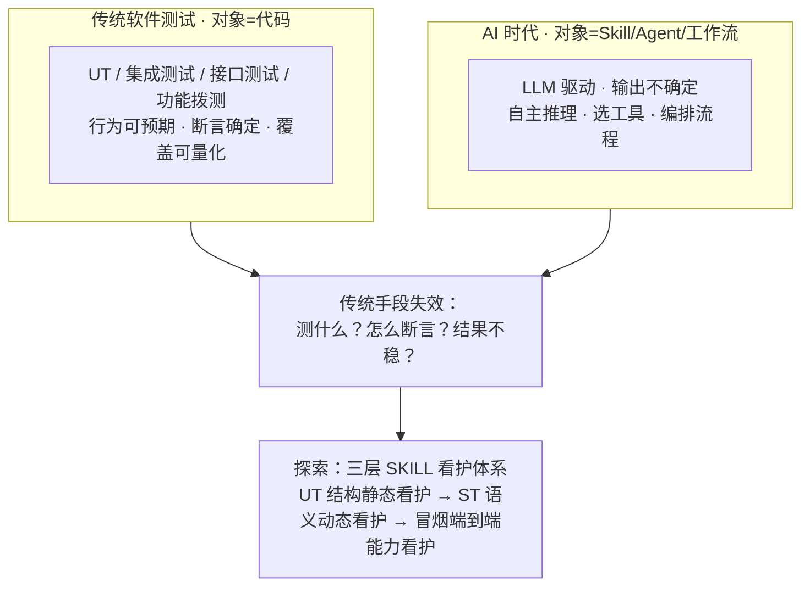
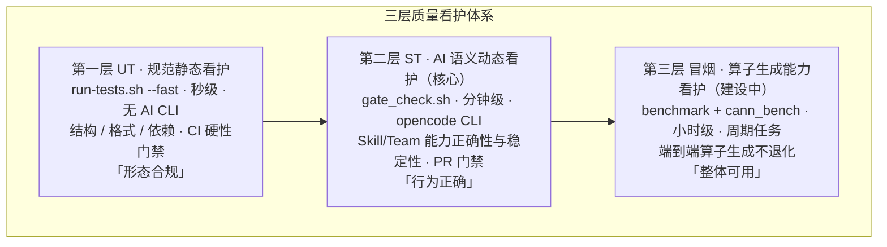
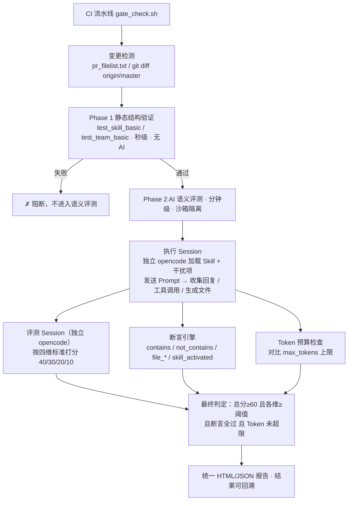
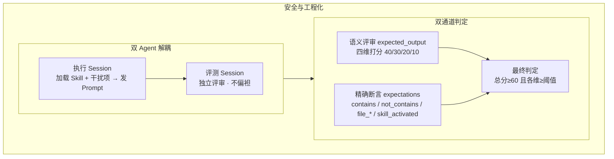

# CANNBot Skills 测试能力

> **主题**：CANNBot（cannbot-skills 仓库）Skill 测试体系的能力现状
> **一句话结论**：已建成 **「静态规范 UT + AI 语义 ST + 端到端算子冒烟」三层质量看护体系**，当前 ST 覆盖 **102 个 Skill + 18 个 Team、841 个启用评测用例**，在 PR 合入门禁中自动运行；第三层冒烟看护（算子生成能力 Daily 看护）正在建设中。

---

## 1. 从传统测试到 AI Skill 看护

### 1.1 传统软件：分层测试，对象明确

传统软件工程用**多层测试**看护代码质量：**单元测试**守住函数/模块，**集成测试**守模块间接口，**接口/契约测试**守对外 API，**功能拨测**守端到端业务。这套体系有效的前提是——**测试对象明确**：代码行为可预期、输出确定，断言可以精确定义，覆盖可以量化。

### 1.2 AI 时代：看护对象变了

到 AI 时代，我们交付的不再是「可预期的代码」，而是 **Skill / Agent / 工作流**：它们由 LLM 驱动、输出不确定，会自主推理、选择工具、编排流程。质量取决于「AI 是否理解需求、是否选对 Skill、是否调用正确、产出是否正确」。

传统手段因此失效，三个问题无法用老办法回答：

| 问题                 | 传统困境                                                           |
| -------------------- | ------------------------------------------------------------------ |
| **测什么？**   | 没有固定的执行路径、函数边界可测，看护对象是自然语言指令驱动的能力 |
| **怎么断言？** | 回复是语义正确而非逐字命中，固定字符串断言频繁误判                 |
| **结果稳吗？** | 同一 Prompt 在不同模型 / 上下文下可能给出不同结果                  |

### 1.3 我们的答案：三层 SKILL 看护

把传统「分层测试」的思想**迁移到 AI 能力**上，用「结构静态看护 → 行为语义看护 → 端到端能力看护」替代「UT / 集成 / 接口 / 拨测」：



下面按这个框架展开：先看整体架构，再逐层介绍，最后给当前覆盖数据与下一步。

---

## 2. 三层质量看护架构



**三层协同**：UT 守住「格式正确、依赖一致」底线 → ST 验证「AI 真正会用、且用得对」→ 冒烟长期保障「整体算子生成能力不退化」。分别覆盖**结构 / 行为 / 端到端业务**，构成完整质量防线；三层按需取舍，ST 是核心。

---

## 3. 第一层 UT — 规范静态看护（`tests/run-tests.sh`）

- **特点**：无需 AI CLI、秒级完成、**CI 硬性门禁**（L1 error 级失败即阻断合入），产出交互式 HTML 报告（`tests/test-ut-report.html`）
- **本质**：一套**规则驱动的静态校验体系**，用编号规则逐项校验每个 Skill / Agent / Team

| 校验域             | 规则                                  | 核心内容                                                                 |
| ------------------ | ------------------------------------- | ------------------------------------------------------------------------ |
| Skill 结构 / 内容  | S-STR-01~21 / S-CON-01~09            | frontmatter、触发关键词、渐进式披露、内链有效性                          |
| **评测门禁** | **S-EVAL-01**                   | **每个 Skill 必须提供合法 `evals/evals.json`（缺失即拦截 CI）**  |
| Agent / Team       | A-STR/CON-01~09 / T-STR-01~08        | 结构、内容、skills 依赖、版本看护                                        |
| 依赖图             | DG-01~11                              | `marketplace.json → plugin.json → AGENTS.md → init.sh` 交叉引用一致 |
| 版本 / 换行 / 安装 | test-version / line-endings / install | 三源版本号同步、CRLF 检测、多 IDE 安装产物                               |

**两大支柱**：S-EVAL-01 强制「每个能力必须有测试用例」的质量文化；DG 依赖图锁死注册链的单一事实来源。
**工程化**：`--incremental` 增量（只测变更）、`--auto-fix` 自动修复、`--parallel N` 并行、text/json/html 多格式输出。

---

## 4. 第二层 ST — AI 语义动态看护（核心，`tests/gate_check.sh`）

### 4.1 定位与全流程

基于 Python/pytest 的 **AI 语义评测系统**：验证 Skill/Team 在真实对话中的回复质量与正确性，CI 流水线自动触发、变更驱动精准评测，支持多平台（A2/A3/A5）与多轮重复求稳定通过率。



**沙箱隔离**：每个用例在独立沙箱 `sandboxes/<skill>_eval_<id>/` 执行，仅透传最小环境变量（PATH/HOME/LLM 密钥），防不可信 prompt 泄露令牌。

### 4.2 五维看护（当前覆盖）

| 维度                   | 测试目标                    | 判定标志（evals.json）               | 当前覆盖                                                                                         |
| ---------------------- | --------------------------- | ------------------------------------ | ------------------------------------------------------------------------------------------------ |
| **正确性看护**   | AI 回复语义覆盖关键要点     | `expected_output` 非空             | ✅**101 Skill / 8 Team**（仅 runtime_migration 无启用用例）                                |
| **资源消耗看护** | Token 消耗监控              | `config.max_tokens`                | ✅**101 Skill / 8 Team**                                                                   |
| **正向看护**     | 多 Skill 并存时正确选中目标 | `config.distractor_skills` 非空    | 🟡**43 Skill + 6 Team**（ops 17 / graph 7 / model 16 / infra 3）                           |
| **调用流程看护** | 关键工具被调 / 文件被生成   | `file_*` / `skill_activated`     | 🟡**34 Skill + 1 Team**（graph/model 域全覆盖）                                            |
| **负向看护**     | 边界场景不被误触发          | `expectations` 中 `not_contains` | 🔴**仅 4 Skill**（ascendc-ut-develop、ascendc-whitebox-design、npu-arch、pypto-op-design） |

**差异化能力**：`distractor_skills` 在同一沙箱部署多个相似 Skill，验证 AI 不「串台」；`skill_activated` 是**程序化**校验（从 session 工具调用记录精确提取，不依赖评审模型），AI 回复正确但加载错 Skill 同样判失败。

### 4.3 核心要义（差异化设计）



| 要义                          | 说明                                                                |
| ----------------------------- | ------------------------------------------------------------------- |
| **双 Agent 解耦**       | 执行 / 评测独立 opencode 会话，避免「裁判员兼运动员」               |
| **语义 + 确定性双通道** | 语义评审容忍措辞差异，精确断言保证严谨，灵活性与严谨互补            |
| **正向看护程序化**      | `skill_activated` 从 session JSON 精确提取，杜绝主观误判          |
| **沙箱隔离 + 安全**     | 独立沙箱、软链接/init.sh 部署、最小环境变量防密钥泄露               |
| **评审模板化**          | 评审 Agent 填`review-template.md`，框架正则解析状态/评分          |
| **并行 + 重试 + 预算**  | `--parallel auto`、`EVAL_EXEC_RETRIES`、`max_tokens_by_model` |

### 4.4 评分体系

**text / file_based（四维评分）**：信息覆盖度 40 / 技术准确性 30 / 回复质量 20 / Token 消耗 10，**总分 ≥ 60 且各维 ≥ 阈值** 方通过（维度阈值可在 `config.dim_thresholds` 覆盖）。

**cann_bench（确定性评测）**：编译通过 = 1 且 精度达标 = 1 且 综合得分 > 50（cann-bench 管道 HAP 评分）。

### 4.5 真实案例：一个 A2 用例的完整链路

以 `ascendc-env-check` 用例「NPU 设备信息查询」（text · A2 · 2026-08-18 CI 记录）为例：

**① 用例定义 → ② 执行 Session**（AI 从技能列表命中 `ascendc-env-check` → 加载 skill → 依据技能内容回复）：

```text
用户：如何查看NPU设备的详细信息，应该使用什么命令？
  ↓ AI 回复
要查看NPU设备的详细信息，使用以下命令：
npu-smi info
该命令会显示设备列表、状态和资源使用情况。如需监控特定设备资源：
npu-smi info -t usages -i <device_id>
```

**③ 评测 Session（独立 AI 评审）**：

| 维度           |     得分     |     阈值     |               判定               |
| -------------- | :----------: | :----------: | :-------------------------------: |
| 覆盖度         |    20/40    |      20      |  YES —`npu-smi info` 完整覆盖  |
| 准确性         |    30/30    |      15      |   YES — 命令/参数准确，无编造   |
| 质量           |    20/20    |      10      | YES — 主命令→监控命令，结构清晰 |
| Token          |    10/10    |      3      |          YES — 简洁高效          |
| **总分** | **80** | **60** |          **PASS**          |

**④ 案例解读**：正确性看护落地（expected_output 精确命中）· 技能选型正确（加载了目标 skill）· 资源看护落地（约 1 万 token ≪ 20 万上限）· 全程可回溯（沙箱保留 session/评审记录）。

---

## 5. 第三层 冒烟 — 整体算子生成能力（建设中）

- **定位**：三层看护的第三层，对接 cann-bench，看护「AI 生成算子代码 → 编译 → 精度 → 性能」端到端能力，是代码上库后的**长期防线**
- **已具备**：① benchmark 批量评测框架（`tests/benchmark/run_eval.py`，提示词→多 Agent 生成→编译→评分→whl）；② cann_bench 模式已接入合入门禁（`gate_check.sh` 自动 clone cann-bench）；③ A5 已启用 `ops-direct-invoke`（mish）、`ops-direct-invoke-flash`（mish、sigmoid）3 个用例
- **下一步**：补齐 Daily 周期调度 → 扩展算子覆盖面（level1~level3）→ 建立长期趋势报告与异常告警

---

## 6. 当前覆盖数据

> 统计口径：**代码仓内所有符合结构要求的 Skill/Team**（Skill 含 `SKILL.md`；Team 含 `AGENTS.md` + `.claude-plugin/plugin.json`），与是否携带 evals **无关**——无 evals 的实体计 0 用例。用例数仅统计已启用（`config.disabled` 非 true）。数据源：`tests/system/docs/ST_COVERAGE_REPORT.md`（2026-08-29）。

| 覆盖对象        |                                数量                                |
| --------------- | :----------------------------------------------------------------: |
| Skill           | **102**（ops 70 / graph 8 / model 18 / infra 5 / runtime 1） |
| Team            |     **18**（plugins-official 10 / plugins-community 8）     |
| ST 用例（启用） |                           **841**                           |

| 域                                |   Skill 数   |    用例数    |
| --------------------------------- | :-----------: | :-----------: |
| ops/                              |      70      |      531      |
| graph/                            |       8       |      66      |
| model/                            |      18      |      169      |
| infra/                            |       5       |      34      |
| runtime/                          |       1       |       0       |
| **Skill 合计**              | **102** | **800** |
| Team（official 10 + community 8） |      18      |      41      |
| **总计**                    | **120** | **841** |

**五维覆盖分析**：正确性与资源消耗两大基础维度**基本全覆盖**（101/102，仅 runtime_migration 无启用用例）；正向看护覆盖约四成（43 Skill + 6 Team）且集中在 graph/model 域；**负向看护是最明显缺口**，仅 4 个 Skill 具备「不该触发时不被误触发」的用例；Team 侧 10/18 尚无任何用例（community 8 个全部为 0）。

---

## 7. 与 anthropics 测试手段的对比

| 维度     | anthropics Evaluating_skill.md                          | CANNBot ST（gate_check.sh）                   |
| -------- | ------------------------------------------------------- | --------------------------------------------- |
| 目的     | 单 Skill 开发期**质量提升闭环**                   | 仓库级**CI 合入门禁**持续看护           |
| 基线对比 | **核心**：with/without Skill 双跑，delta 证明价值 | 无基线，直接验证回复正确性                    |
| 迭代     | `iteration-N/` + benchmark + 盲评 + 人工反馈          | 每次 PR 独立运行，无跨版本回归对比            |
| 规模化   | 单 Skill 细粒度迭代                                     | **102 Skill + 18 Team 批量**，沙箱并行  |
| 断言     | `assertions`（LLM 打分 + 机械检查）                   | `expectations` 六类 + 语义评审 + Token 预算 |
| 视角     | 「这个 Skill 好不好」                                   | 「这次合入有没有引入回归」                    |

**可借鉴**：① with/without 基线对比（量化 Skill 价值，支撑「该不该收」决策）；② 跨迭代回归统计（从「单次门禁」升级为「趋势看护」，呼应第三层冒烟）；③ 盲评（降低评审偏见）。

---

## 8. 总结与下一步

**当前状态**：CANNBot 已建成「UT（静态规范硬门禁）+ ST（AI 语义动态评测，102 Skill + 18 Team / 841 用例，五维看护）」两大防线并在 CI 门禁中稳定运行；第三层冒烟看护框架与用例已就绪、正在补齐周期调度。

**下一步：从「合入门禁」升级为「平台化趋势看护」**——将看护能力沉淀为持续基线，让质量防线从「拦截一次合入」走向「长期可观测、可对比、可追踪」：

1. **构建 Skill 看护与算子生成能力的在线平台**：将看护能力**基线化**（固化可对比的质量基准线）、**平台化**（集中沉淀用例、报告与评测能力）、**趋势化**（按版本持续观测演进），形成统一的可视化看护入口。
2. **补齐冒烟周期调度**：cann_bench **Daily 看护** + 长期**趋势报告**，长期保障「AI 生成算子 → 编译 → 精度 → 性能」端到端能力不退化。
3. **完善 ST 测试能力**：引入 **with/without 基线对比**与**跨版本回归趋势**，让 ST 从「单次合入门禁」升级为「趋势看护」。

---

*数据来源：`tests/system/docs/ST_DESIGN_AND_DEVELOPMENT_GUIDE.md`、`ST_COVERAGE_REPORT.md`、`ST_COVERAGE_SPECIFICATION.md`、`tests/run-tests.sh`、`tests/gate_check.sh`、`tests/benchmark/README.md`、`wangyi_ws/Evaluating_skill.md`。*
